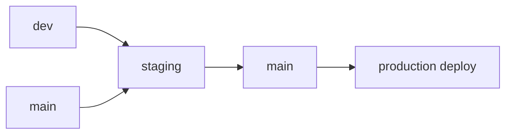

# Rekrut AI — Production Deployment Runbook

> **Version:** 1.0  
> **Date:** 2026-06-09  
> **Owner:** DevOps Automator  
> **Scope:** Fix all critical blockers (B1–B8) before production deploy  
> **Status:** 🔴 NO-GO until B1–B6 are resolved

---

## Table of Contents

1. [Critical Blocker Fixes (B1–B8)](#1-critical-blocker-fixes-b1b8)
2. [Corrected `render.yaml` Blueprint](#2-corrected-renderyaml-blueprint)
3. [Branch Merge Strategy](#3-branch-merge-strategy)
4. [Pre-Deploy Checklist](#4-pre-deploy-checklist)
5. [Post-Deploy Verification](#5-post-deploy-verification)
6. [Rollback Plan](#6-rollback-plan)
7. [Timeline & Owner Assignments](#7-timeline--owner-assignments)

---

## 1. Critical Blocker Fixes (B1–B8)

### 🔴 B1 — Production plan is `free`, must be `standard`

**Evidence:** Render API shows `"plan": "free"`. `render.yaml` specifies `standard`. Free plan has sleep/wake cycles, limited CPU/memory, and is unsuitable for production traffic.

**Impact:** Service will sleep after inactivity, causing cold starts (~5–10s). Insufficient resources for production load.

**Fix Steps:**
1. Log in to [Render Dashboard](https://dashboard.render.com).
2. Navigate to **rekrutai-prod** → **Settings** → **Plan**.
3. Change from **Free** → **Standard** ($25/month).
4. Confirm billing. Render will redeploy automatically.
5. Verify: `curl https://rekrutai.co/health` returns 200 within 2 seconds.

**Rollback:** Downgrade back to Free in Dashboard (not recommended for production).

---

### 🔴 B2 — Production `healthCheckPath` is empty

**Evidence:** Render API shows `"healthCheckPath": ""`. `render.yaml` specifies `/health`. The `/health` endpoint returns 200 with `{"status":"ok"}`.

**Impact:** Render cannot detect unhealthy instances. Failed deploys will not auto-roll back. Manual restarts may serve broken traffic.

**Fix Steps:**
1. Render Dashboard → **rekrutai-prod** → **Settings** → **Health Check Path**.
2. Enter `/health`.
3. Click **Save Changes**.
4. Verify: In the Dashboard **Metrics** tab, the health-check graph should show green.
5. Verify via CLI: `curl -I https://rekrutai.co/health` → expect `HTTP/2 200`.

---

### 🔴 B3 — Production `startCommand` differs from blueprint

**Evidence:** Render API shows `node server.js`. `render.yaml` specifies `npm run migrate && npm start`. The `npm run migrate` step is missing, meaning DB migrations do **not** auto-run on deploy.

**Impact:** Schema changes on `dev`/`staging` will not be applied to production. App may crash with "column does not exist" errors after deploy.

**Fix Steps:**
1. Render Dashboard → **rekrutai-prod** → **Settings** → **Start Command**.
2. Replace `node server.js` with:
   ```bash
   npm run migrate && npm start
   ```
3. Save changes.
4. Verify the command is shown correctly in the Dashboard **Settings** panel.
5. On next deploy, check logs for `migrate.js` output: `SELECT * FROM migrations` or similar success message.

**Note:** Do NOT add `node migrate.js` to the **Build Command**. Migrations require a running database, which may not be available during the build phase. The build command should only compile assets.

---

### 🔴 B4 — `POLSIA_API_KEY` not set

**Evidence:** Missing from the 16 returned env vars. Primary AI proxy is dead. All AI features (matching, screening, coaching) will fail.

**Impact:** 100% of AI-dependent features return 500 or empty responses. Core product value is non-functional.

**Fix Steps:**
1. Obtain the Polsia API key from the Polsia provider dashboard.
2. Render Dashboard → **rekrutai-prod** → **Environment** → **Add Environment Variable**.
3. Key: `POLSIA_API_KEY`
4. Value: `[paste key from Polsia dashboard]`
5. Also set `POLSIA_API_URL` if a custom endpoint is used (e.g., `https://api.polsia.ai/v1`).
6. Save. No redeploy required (env vars are injected at runtime).
7. Verify: `curl https://rekrutai.co/health` still 200. Then test an AI feature (e.g., job matching) via the UI or API.

---

### 🔴 B5 — Stripe keys are TEST mode (`sk_test_`)

**Evidence:** `STRIPE_SECRET_KEY` starts with `sk_test_`. `STRIPE_PUBLISHABLE_KEY` starts with `pk_test_`. Live payments cannot be processed.

**Impact:** Users cannot make real payments. Checkout sessions will fail with "test mode" errors.

**Fix Steps:**
1. **CEO approval required** (Ranga). Notify: Stripe must be switched to live mode.
2. Log in to [Stripe Dashboard](https://dashboard.stripe.com) → Developers → API keys.
3. Copy **Live** secret key (`sk_live_...`) and publishable key (`pk_live_...`).
4. Render Dashboard → **rekrutai-prod** → **Environment**.
5. Update:
   - `STRIPE_SECRET_KEY` → `sk_live_...`
   - `STRIPE_PUBLISHABLE_KEY` → `pk_live_...`
6. Update `STRIPE_WEBHOOK_SECRET` with the live webhook endpoint secret.
   - In Stripe Dashboard → Developers → Webhooks → Add endpoint.
   - URL: `https://rekrutai.co/api/billing/webhook`
   - Events: `checkout.session.completed`, `invoice.payment_succeeded`, `customer.subscription.updated`, etc.
7. Save.
8. Verify: Create a test checkout session with a $0.50 test product. The Stripe Dashboard should show a live payment.

**Rollback:** Revert to `sk_test_` keys in Render Dashboard if issues arise.

---

### 🔴 B6 — Production branch (`main`) is behind `dev`

**Evidence:**
- `main` at `c3d46f0` (ahead 2, behind ~10+)
- `dev` at `bbd24e2` (latest)
- `staging` at `5809ff8` (ahead 3, diverged from `main`)

**Impact:** Deploying `main` now would push outdated code missing critical fixes (E2E shard runner, admin login cleanup, build artifacts cleanup).

**Fix Steps:**

**Step 1 — Clean the working tree**
```bash
git checkout staging
git status
```
- Commit `.env.example` changes and `.tsx` code changes if they are production-ready.
- For `client/dist/` build artifacts: **do not commit**. These are generated by CI/CD. Add to `.gitignore` if not already present:
  ```
  client/dist/assets/*.js
  ```
  Or run: `git reset --hard HEAD` for dist files only if they are safe to discard. ⚠️ Check `client/dist/index.html` — if it has meaningful changes, commit it separately.

**Step 2 — Push local staging commits**
```bash
git push origin staging
```

**Step 3 — Sync `main` into `staging` first**
```bash
git checkout staging
git merge origin/main
```
Resolve any merge conflicts. `main` is 2 commits ahead of `staging`; these must be included.

**Step 4 — Merge `dev` into `staging`**
```bash
git merge origin/dev
```
Resolve any merge conflicts. The `dev` branch has ~10+ commits not on `main`.

**Step 5 — Test on staging**
- Staging auto-deploys (`autoDeploy: true`). Wait for deploy to complete.
- Run smoke tests (see [Section 5](#5-post-deploy-verification)).
- If tests fail, fix on `dev`, merge again, and re-test.

**Step 6 — Merge `staging` into `main`**
```bash
git checkout main
git merge staging
```
- Ensure a linear or clean merge history. Prefer `git merge --no-ff staging` to preserve the merge commit.
- Push: `git push origin main`

**Step 7 — Deploy to production**
- Production has `autoDeploy: false`. Manual deploy required.
- Render Dashboard → **rekrutai-prod** → **Manual Deploy** → **Deploy latest commit**.

---

### 🔴 B7 — Production DB config mismatch: `render.yaml` vs. Neon

**Evidence:** `render.yaml` defines `fromDatabase: rekrutai-prod-db` (Render PostgreSQL), but the actual `DATABASE_URL` is a Neon URL. The Render PostgreSQL `rekrutai-prod-db` exists but is unused.

**Impact:** If blueprint sync runs, it may overwrite the Neon `DATABASE_URL` with the Render PostgreSQL connection string, breaking the app. Also paying for an unused database.

**Fix Steps:**

**Decision:** Keep Neon (currently working, production-stable). Migrate to Render PostgreSQL later if desired.

1. **Update `render.yaml`** (see corrected blueprint below):
   - Change production `DATABASE_URL` from `fromDatabase` to `sync: false`.
   - This prevents the blueprint from overwriting the manually-set Neon URL.
2. **Verify Neon URL in Render Dashboard:**
   - Render Dashboard → **rekrutai-prod** → **Environment**.
   - Confirm `DATABASE_URL` is the Neon URL.
3. **Optional — Remove unused Render PostgreSQL:**
   - Render Dashboard → **rekrutai-prod-db** → **Settings** → **Delete**.
   - ⚠️ **Verify no data exists in this database before deleting.**
   - Alternatively, keep it as a cold standby and restrict its IP allow list to Render services only (see N4 in prod-readiness).

---

### 🔴 B8 — `NODE_ENV`, `REKRUT_AI_URL`, `CORS_ORIGINS` not explicitly set

**Evidence:** Not in the 16 env vars returned by Render API. `render.yaml` defines them with `value`, but the service may have been created manually or blueprint sync was incomplete.

**Impact:**
- Missing `NODE_ENV` → app may run in dev mode (verbose errors, no SSL enforcement).
- Missing `CORS_ORIGINS` → frontend requests from `rekrutai.co` may be blocked.
- Missing `REKRUT_AI_URL`/`APP_URL`/`FRONTEND_URL`/`BASE_URL` → links in emails/redirects will be wrong.

**Fix Steps:**
1. Render Dashboard → **rekrutai-prod** → **Environment**.
2. Add or verify the following:
   | Key | Value |
   |-----|-------|
   | `NODE_ENV` | `production` |
   | `REKRUT_AI_URL` | `https://rekrutai.co` |
   | `APP_URL` | `https://rekrutai.co` |
   | `FRONTEND_URL` | `https://rekrutai.co` |
   | `BASE_URL` | `https://rekrutai.co` |
   | `CORS_ORIGINS` | `https://rekrutai.co,https://www.rekrutai.co` |
   | `FORCE_SSL_VERIFY` | `true` |
3. Save. No redeploy required.
4. Verify: `curl -H "Origin: https://rekrutai.co" https://rekrutai.co/api/health` → expect 200 with CORS headers.

---

## 2. Corrected `render.yaml` Blueprint

The following `render.yaml` is the **source of truth** for production configuration. The Render Dashboard settings must be updated to match this blueprint. The file is already corrected for `plan`, `healthCheckPath`, and `startCommand`. The only code change is to production `DATABASE_URL` (changed from `fromDatabase` to `sync: false` to preserve the Neon URL).

```yaml
services:
  - type: web
    name: rekrutai-prod
    env: node
    branch: main
    buildCommand: cd client && npm install --include=dev && npm run build && cd .. && npm install
    startCommand: npm run migrate && npm start
    healthCheckPath: /health
    envVars:
      - key: NODE_ENV
        value: production
      - key: PORT
        value: 10000
      - key: DATABASE_URL
        sync: false          # ← CHANGED: preserves manually-set Neon URL
      - key: REKRUT_AI_URL
        value: https://rekrutai.co
      - key: APP_URL
        value: https://rekrutai.co
      - key: FRONTEND_URL
        value: https://rekrutai.co
      - key: BASE_URL
        value: https://rekrutai.co
      - key: CORS_ORIGINS
        value: https://rekrutai.co,https://www.rekrutai.co
      - key: JWT_SECRET
        sync: false
      - key: SESSION_SECRET
        sync: false
      - key: ADMIN_USERNAME
        sync: false
      - key: ADMIN_PASSWORD
        sync: false
      - key: STRIPE_SECRET_KEY
        sync: false
      - key: STRIPE_WEBHOOK_SECRET
        sync: false
      - key: POLSIA_API_KEY
        sync: false
      - key: POLSIA_API_URL
        sync: false
      - key: OPENAI_API_KEY
        sync: false
      - key: OPENAI_BASE_URL
        sync: false
      - key: OPENAI_DAILY_TOKEN_BUDGET
        sync: false
      - key: NVIDIA_NIM_API_KEY
        sync: false
      - key: NIM_BASE_URL
        sync: false
      - key: GROQ_API_KEY
        sync: false
      - key: CEREBRAS_API_KEY
        sync: false
      - key: DEEPGRAM_API_KEY
        sync: false
      - key: NIM_LLM_MODEL
        sync: false
      - key: NIM_LLM_LLAMA_8B
        sync: false
      - key: NIM_LLM_LLAMA_70B
        sync: false
      - key: NIM_LLM_GEMMA
        sync: false
      - key: NIM_LLM_GPT_OSS
        sync: false
      - key: NIM_LLM_NANO_30B
        sync: false
      - key: NIM_LLM_STEP_FLASH
        sync: false
      - key: NIM_LLM_ULTRA
        sync: false
      - key: NIM_REASONING_QWQ
        sync: false
      - key: NIM_SAFETY_MODEL
        sync: false
      - key: NIM_SAFETY_REASONING
        sync: false
      - key: NIM_VISION_GEMMA
        sync: false
      - key: NIM_VISION_FALLBACK_MODEL
        sync: false
      - key: NIM_EMBED_MODEL
        sync: false
      - key: NIM_EMBED_VL
        sync: false
      - key: NIM_DOCUMENT_MODEL
        sync: false
      - key: NIM_ASR_MODEL
        sync: false
      - key: NIM_ASR_V3
        sync: false
      - key: NIM_TTS_BASE_URL
        sync: false
      - key: NIM_FASTPITCH_BASE_URL
        sync: false
      - key: NIM_MAGPIE_ZERO_BASE_URL
        sync: false
      - key: NIM_MAGPIE_FLOW_BASE_URL
        sync: false
      - key: NIM_MAGPIE_MULTI_BASE_URL
        sync: false
      - key: R2_ACCESS_KEY_ID
        sync: false
      - key: R2_SECRET_ACCESS_KEY
        sync: false
      - key: R2_BUCKET_NAME
        sync: false
      - key: R2_ENDPOINT
        sync: false
      - key: R2_PUBLIC_URL
        sync: false
      - key: EMAIL_HOST
        sync: false
      - key: EMAIL_PORT
        sync: false
      - key: EMAIL_USER
        sync: false
      - key: EMAIL_PASS
        sync: false
      - key: EMAIL_FROM_ADDRESS
        sync: false
      - key: EMAIL_FROM_NAME
        sync: false
      - key: EMAIL_RATE_LIMIT
        sync: false
      - key: EMAIL_RATE_LIMIT_HOUR
        sync: false
      - key: EMAIL_RETRY_ATTEMPTS
        sync: false
      - key: EMAIL_RETRY_DELAY
        sync: false
      - key: SMTP_HOST
        sync: false
      - key: SMTP_PORT
        sync: false
      - key: SMTP_USER
        sync: false
      - key: SMTP_PASS
        sync: false
      - key: SMTP_SECURE
        sync: false
      - key: SMTP_FROM
        sync: false
      - key: GOOGLE_CLIENT_ID
        sync: false
      - key: GOOGLE_CLIENT_SECRET
        sync: false
      - key: GOOGLE_REDIRECT_URI
        sync: false
      - key: LINKEDIN_CLIENT_ID
        sync: false
      - key: LINKEDIN_CLIENT_SECRET
        sync: false
      - key: LINKEDIN_REDIRECT_URI
        sync: false
      - key: FORCE_SSL_VERIFY
        value: true
    autoDeploy: false
    numInstances: 1
    plan: standard

  # ── Staging ──────────────────────────────────────
  - type: web
    name: rekrutai-staging
    env: node
    branch: staging
    buildCommand: cd client && npm install --include=dev && npm run build && cd .. && npm install
    startCommand: npm run migrate && npm start
    healthCheckPath: /health
    envVars:
      - key: NODE_ENV
        value: staging
      - key: PORT
        value: 10000
      - key: DATABASE_URL
        fromDatabase:
          name: rekrutai-staging-db
          property: connectionString
      - key: REKRUT_AI_URL
        value: https://rekrutai-staging.onrender.com
      - key: APP_URL
        value: https://rekrutai-staging.onrender.com
      - key: FRONTEND_URL
        value: https://rekrutai-staging.onrender.com
      - key: BASE_URL
        value: https://rekrutai-staging.onrender.com
      - key: CORS_ORIGINS
        value: https://rekrutai-staging.onrender.com
      - key: JWT_SECRET
        generateValue: true
      - key: SESSION_SECRET
        generateValue: true
      - key: ADMIN_USERNAME
        sync: false
      - key: ADMIN_PASSWORD
        sync: false
      - key: STRIPE_SECRET_KEY
        sync: false
      - key: STRIPE_WEBHOOK_SECRET
        sync: false
      - key: POLSIA_API_KEY
        sync: false
      - key: POLSIA_API_URL
        sync: false
      - key: OPENAI_API_KEY
        sync: false
      - key: OPENAI_BASE_URL
        sync: false
      - key: NVIDIA_NIM_API_KEY
        sync: false
      - key: NIM_BASE_URL
        sync: false
      - key: GROQ_API_KEY
        sync: false
      - key: CEREBRAS_API_KEY
        sync: false
      - key: DEEPGRAM_API_KEY
        sync: false
      - key: R2_ACCESS_KEY_ID
        sync: false
      - key: R2_SECRET_ACCESS_KEY
        sync: false
      - key: R2_BUCKET_NAME
        sync: false
      - key: R2_ENDPOINT
        sync: false
      - key: R2_PUBLIC_URL
        sync: false
      - key: EMAIL_HOST
        sync: false
      - key: EMAIL_PORT
        sync: false
      - key: EMAIL_USER
        sync: false
      - key: EMAIL_PASS
        sync: false
      - key: EMAIL_FROM_ADDRESS
        sync: false
      - key: EMAIL_FROM_NAME
        sync: false
      - key: SMTP_HOST
        sync: false
      - key: SMTP_PORT
        sync: false
      - key: SMTP_USER
        sync: false
      - key: SMTP_PASS
        sync: false
      - key: GOOGLE_CLIENT_ID
        sync: false
      - key: GOOGLE_CLIENT_SECRET
        sync: false
      - key: GOOGLE_REDIRECT_URI
        sync: false
      - key: LINKEDIN_CLIENT_ID
        sync: false
      - key: LINKEDIN_CLIENT_SECRET
        sync: false
      - key: LINKEDIN_REDIRECT_URI
        sync: false
      - key: FORCE_SSL_VERIFY
        value: true
    autoDeploy: true
    numInstances: 1
    plan: starter            # ← ADDED: staging should not be free

  # ── Development ────────────────────────────────────
  - type: web
    name: rekrutai-dev
    env: node
    branch: dev
    buildCommand: cd client && npm install --include=dev && npm run build && cd .. && npm install
    startCommand: npm run migrate && npm start
    healthCheckPath: /health
    envVars:
      - key: NODE_ENV
        value: development
      - key: PORT
        value: 10000
      - key: DATABASE_URL
        fromDatabase:
          name: rekrutai-dev-db
          property: connectionString
      - key: REKRUT_AI_URL
        value: https://rekrutai-dev.onrender.com
      - key: APP_URL
        value: https://rekrutai-dev.onrender.com
      - key: FRONTEND_URL
        value: https://rekrutai-dev.onrender.com
      - key: BASE_URL
        value: https://rekrutai-dev.onrender.com
      - key: CORS_ORIGINS
        value: https://rekrutai-dev.onrender.com
      - key: JWT_SECRET
        generateValue: true
      - key: SESSION_SECRET
        generateValue: true
      - key: ADMIN_USERNAME
        sync: false
      - key: ADMIN_PASSWORD
        sync: false
      - key: STRIPE_SECRET_KEY
        sync: false
      - key: STRIPE_WEBHOOK_SECRET
        sync: false
      - key: POLSIA_API_KEY
        sync: false
      - key: POLSIA_API_URL
        sync: false
      - key: OPENAI_API_KEY
        sync: false
      - key: OPENAI_BASE_URL
        sync: false
      - key: NVIDIA_NIM_API_KEY
        sync: false
      - key: NIM_BASE_URL
        sync: false
      - key: GROQ_API_KEY
        sync: false
      - key: CEREBRAS_API_KEY
        sync: false
      - key: DEEPGRAM_API_KEY
        sync: false
      - key: R2_ACCESS_KEY_ID
        sync: false
      - key: R2_SECRET_ACCESS_KEY
        sync: false
      - key: R2_BUCKET_NAME
        sync: false
      - key: R2_ENDPOINT
        sync: false
      - key: R2_PUBLIC_URL
        sync: false
      - key: EMAIL_HOST
        sync: false
      - key: EMAIL_PORT
        sync: false
      - key: EMAIL_USER
        sync: false
      - key: EMAIL_PASS
        sync: false
      - key: EMAIL_FROM_ADDRESS
        sync: false
      - key: EMAIL_FROM_NAME
        sync: false
      - key: SMTP_HOST
        sync: false
      - key: SMTP_PORT
        sync: false
      - key: SMTP_USER
        sync: false
      - key: SMTP_PASS
        sync: false
      - key: GOOGLE_CLIENT_ID
        sync: false
      - key: GOOGLE_CLIENT_SECRET
        sync: false
      - key: GOOGLE_REDIRECT_URI
        sync: false
      - key: LINKEDIN_CLIENT_ID
        sync: false
      - key: LINKEDIN_CLIENT_SECRET
        sync: false
      - key: LINKEDIN_REDIRECT_URI
        sync: false
      - key: FORCE_SSL_VERIFY
        value: false
    autoDeploy: true
    numInstances: 1
    # dev remains free (acceptable for development)

  # ── Databases ────────────────────────────────────
  - type: pserv
    name: rekrutai-prod-db
    env: postgresql
    branch: main
    plan: standard
    ipAllowList: []
    # NOTE: Currently unused — app uses Neon. Consider deleting to save costs.

  - type: pserv
    name: rekrutai-staging-db
    env: postgresql
    branch: staging
    plan: starter
    ipAllowList: []

  - type: pserv
    name: rekrutai-dev-db
    env: postgresql
    branch: dev
    plan: starter
    ipAllowList: []
```

**How to sync the blueprint to the service:**
1. Push the updated `render.yaml` to the `main` branch.
2. Render Dashboard → **rekrutai-prod** → **Settings** → **Blueprint**.
3. If the service is already connected to a blueprint, click **Sync Blueprint**.
4. If not connected, follow Render's [Blueprint documentation](https://render.com/docs/blueprint) to link the service to `render.yaml` on the `main` branch.
5. After sync, verify that `plan`, `healthCheckPath`, and `startCommand` match the blueprint values above.

---

## 3. Branch Merge Strategy

### Current State

| Branch | Commit | Status |
|--------|--------|--------|
| `dev` | `bbd24e2` | Latest, ~10+ commits ahead of `main` |
| `main` | `c3d46f0` | Production branch, 2 commits ahead of `staging` |
| `staging` | `5809ff8` | 3 local commits ahead of `origin/staging` |

### Strategy: `dev` → `staging` → `main` (with main sync)



### Step-by-Step

| Step | Action | Command | Notes |
|------|--------|---------|-------|
| 1 | Clean working tree | `git status` | Commit `.tsx` and `.env.example` changes. Discard `client/dist` build artifacts (do not commit). |
| 2 | Push staging | `git push origin staging` | Publish the 3 local commits. |
| 3 | Merge `main` into `staging` | `git checkout staging && git merge origin/main` | Resolve any conflicts. `main` is 2 commits ahead. |
| 4 | Merge `dev` into `staging` | `git merge origin/dev` | Resolve any conflicts. Bring in ~10+ commits. |
| 5 | Verify on staging | `curl https://rekrutai-staging.onrender.com/health` | Staging auto-deploys. Wait for deploy. Run smoke tests. |
| 6 | Merge `staging` into `main` | `git checkout main && git merge --no-ff staging` | Preserve merge commit for traceability. |
| 7 | Push `main` | `git push origin main` | |
| 8 | Deploy production | Render Dashboard → Manual Deploy | Production has `autoDeploy: false`. |

### Branch Protection Rules (Recommended)

After production is stable, configure GitHub branch protection:
- `main`: Require PR review (1 approver), require status checks, no direct pushes.
- `staging`: Require PR review, allow auto-deploy.
- `dev`: Open for direct pushes, auto-deploy.

---

## 4. Pre-Deploy Checklist

### Environment & Config

- [ ] **B1** — Production plan is `standard` (not `free`).
- [ ] **B2** — `healthCheckPath` is `/health`.
- [ ] **B3** — `startCommand` is `npm run migrate && npm start`.
- [ ] **B4** — `POLSIA_API_KEY` is set.
- [ ] **B5** — Stripe live keys are set (`sk_live_*`, `pk_live_*`).
- [ ] **B6** — `main` branch is up to date with `dev` (code merged).
- [ ] **B7** — `DATABASE_URL` points to Neon (not overwritten by blueprint).
- [ ] **B8** — `NODE_ENV=production`, `CORS_ORIGINS`, `REKRUT_AI_URL` are set.
- [ ] **Secrets** — `JWT_SECRET`, `SESSION_SECRET`, `ADMIN_PASSWORD` are strong (≥256 bits, random).
- [ ] **Emails** — `EMAIL_HOST`, `EMAIL_USER`, `EMAIL_PASS` are set (if email is required for launch).
- [ ] **R2** — `R2_ACCESS_KEY_ID`, `R2_SECRET_ACCESS_KEY`, `R2_BUCKET_NAME` are set (if file uploads required).
- [ ] **OAuth** — `GOOGLE_CLIENT_ID`, `GOOGLE_CLIENT_SECRET`, `LINKEDIN_CLIENT_ID` are set (if social login required).

### Health Checks (per healthcheck skill)

- [ ] `curl -I https://rekrutai.co/health` → `HTTP/2 200`
- [ ] `curl -I https://rekrutai-staging.onrender.com/health` → `HTTP/2 200`
- [ ] Response time < 2 seconds on both.
- [ ] Response body contains `{"status":"ok"}`.
- [ ] No 5xx errors in the last 24 hours (check Render Dashboard → Metrics).

### Smoke Tests (Manual)

| Test | Endpoint / Flow | Expected Result |
|------|-----------------|-----------------|
| Health check | `GET /health` | `{"status":"ok"}` |
| Landing page | `GET /` | Loads without 5xx |
| Candidate login | `POST /api/auth/login` | 200 + JWT token |
| Recruiter login | `POST /api/auth/login` | 200 + JWT token |
| Admin login | `POST /api/admin/login` | 200 + session cookie |
| AI matching | `POST /api/matching` | 200 + recommendations (requires B4) |
| Job creation | `POST /api/jobs` | 201 + job ID |
| Stripe checkout | `POST /api/billing/checkout` | 200 + checkout URL (requires B5) |
| File upload | `POST /api/documents` | 201 + document URL (requires R2) |
| Email send | `POST /api/communications/send` | 200 / queued (requires email) |
| Google OAuth | `/api/auth/google` | Redirects to Google (requires OAuth) |
| LinkedIn OAuth | `/api/auth/linkedin` | Redirects to LinkedIn (requires OAuth) |
| CORS preflight | `OPTIONS /api/health` | 200 with correct CORS headers |

### Database

- [ ] Production DB snapshot taken (Neon has automatic backups; verify retention).
- [ ] Migrations are idempotent and tested on `dev` and `staging`.
- [ ] `node migrate.js` runs successfully on `dev` and `staging`.
- [ ] No destructive migrations in the deploy batch (no `DROP TABLE`, `DROP COLUMN` without data migration).

### Rollback Preparation

- [ ] Note the current production commit hash: `c42fcc8`.
- [ ] Note the current `DATABASE_URL` and all env var values (screenshot or export).
- [ ] Stripe webhook endpoint is configured for live mode (if B5 is done).
- [ ] Rollback command ready: `git checkout c42fcc8 && git push origin main --force` (emergency only) OR Render Dashboard → Manual Deploy → select previous commit.
- [ ] Database rollback plan: Neon point-in-time restore (last 7 days).

---

## 5. Post-Deploy Verification

### Immediate (0–5 minutes after deploy)

| # | Check | Command / Action | Pass Criteria |
|---|-------|------------------|---------------|
| 1 | Health check | `curl https://rekrutai.co/health` | 200, `< 2s`, `{"status":"ok"}` |
| 2 | Custom domain | `curl https://rekrutai.co/health` | Resolves to production |
| 3 | Render URL | `curl https://rekrut-ai.onrender.com/health` | 200, same response |
| 4 | Build success | Render Dashboard → Logs | No `npm ERR!` or build failures |
| 5 | Migration success | Render Dashboard → Logs | `migrate.js` completes without errors |
| 6 | Service status | Render Dashboard → rekrutai-prod | Status = `live`, no crash loops |

### Short-term (5–30 minutes)

| # | Check | Action | Pass Criteria |
|---|-------|--------|---------------|
| 7 | Login flow | Log in as candidate + recruiter | 200, JWT returned, no CORS errors |
| 8 | AI feature | Run job matching or screening | Returns results (requires B4) |
| 9 | Stripe test | Create a $0.50 checkout session | Stripe Dashboard shows live attempt (requires B5) |
| 10 | File upload | Upload a PDF resume | 201, returns R2 URL (requires R2) |
| 11 | Email | Trigger password reset | Email received in inbox (requires email) |
| 12 | OAuth | Click "Sign in with Google" | Redirects to Google consent (requires OAuth) |
| 13 | Admin panel | Log in to `/admin` | Dashboard loads, no 403 |
| 14 | Error rate | Render Dashboard → Metrics | 5xx rate < 1% |
| 15 | Response time | Render Dashboard → Metrics | P95 < 1s for health, < 3s for API |

### Long-term (1–24 hours)

| # | Check | Action | Pass Criteria |
|---|-------|--------|---------------|
| 16 | Uptime | Set up UptimeRobot (free tier) for `https://rekrutai.co/health` | Checks every 5 minutes |
| 17 | Logs | Review Render logs for errors | No unhandled exceptions |
| 18 | Security headers | `curl -I https://rekrutai.co/health` | After CRITICAL-1/CRITICAL-2 fixes, HSTS + CSP present |
| 19 | Rate limiting | Hit `/api/auth/login` 6 times rapidly | 429 returned on 6th attempt |
| 20 | CSRF | Make a POST without `X-CSRF-Token` | 403 Forbidden |

---

## 6. Rollback Plan

### Trigger Conditions

Deploy immediately if any of the following occur:
- Health check fails for > 2 minutes after deploy.
- 5xx error rate > 10% for > 5 minutes.
- Database migration fails (app crashes on startup).
- Payment flow is broken (Stripe checkout fails).
- AI features are completely non-functional (B4 not resolved).

### Rollback Steps

**Option A: Render Dashboard (Fastest — 2 minutes)**
1. Render Dashboard → **rekrutai-prod** → **Manual Deploy**.
2. Select the previous successful commit (`c42fcc8`).
3. Click **Deploy**.
4. Verify health check returns 200 within 2 minutes.

**Option B: Git Revert (5 minutes)**
```bash
git checkout main
git revert --no-commit HEAD    # or git reset --hard c42fcc8
git push origin main
```
Then trigger Manual Deploy in Render Dashboard.

**Option C: Database Rollback (if migration broke data)**
1. Neon Console → **Backups** → **Point-in-time restore**.
2. Restore to timestamp just before deploy.
3. Update `DATABASE_URL` in Render Dashboard if the restore creates a new endpoint.
4. Redeploy.

**Post-rollback:**
- Notify team in Slack/Discord.
- Create a hotfix branch from `main`.
- Fix the issue, test on `dev`/`staging`, and re-deploy.

---

## 7. Timeline & Owner Assignments

| Blocker | Task | Owner | ETA | Priority |
|---------|------|-------|-----|----------|
| B1 | Upgrade plan to `standard` | DevOps | 15 min | P0 |
| B2 | Set `healthCheckPath` | DevOps | 5 min | P0 |
| B3 | Fix `startCommand` | DevOps | 5 min | P0 |
| B4 | Set `POLSIA_API_KEY` | DevOps / AI Team | 15 min | P0 |
| B5 | Switch Stripe to live mode | CEO (Ranga) + DevOps | 30 min | P0 |
| B6 | Merge `dev` → `main` | DevOps | 1–2 hr | P0 |
| B7 | Fix DB config mismatch | DevOps | 15 min | P0 |
| B8 | Verify core env vars | DevOps | 15 min | P0 |
| B9 | Configure email/SMTP | DevOps | 1 hr | P1 |
| B10 | Configure R2 storage | DevOps | 30 min | P1 |
| B11 | Configure Google OAuth | DevOps + Frontend | 1 hr | P1 |
| B12 | Configure LinkedIn OAuth | DevOps + Frontend | 1 hr | P1 |
| B13 | Set NIM model configs | DevOps / AI Team | 30 min | P1 |
| B15 | Commit `client/dist` cleanup | DevOps | 15 min | P1 |
| N1 | Set up UptimeRobot | DevOps | 15 min | P2 |
| N4 | Restrict DB IP allow list | DevOps | 10 min | P2 |

**Go/No-Go Gate:** After B1–B8 are resolved and smoke tests pass on staging, a final go/no-go decision is made by the CEO and DevOps lead.

---

*End of runbook. Update this document after each deploy with actual commit hashes, deploy times, and any deviations.*
