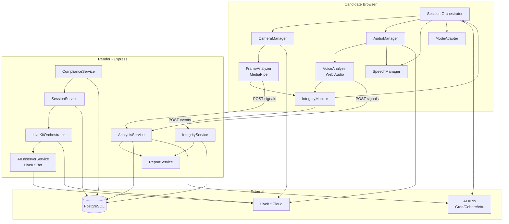
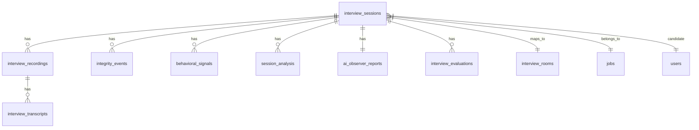

# Unified Interview Engine — Architecture

> **Status:** Draft | **Version:** 1 | **Owner:** Sumanth
> **PRD:** `docs/sdlc/rekrut-ai-v2/02-planning/unified-interview-engine-prd.md` (v2.1, approved)

---

## 1. System Overview

The Unified Interview Engine is a modular subsystem within the Rekrut AI v2 monolith that orchestrates all four interview modes (Mock, AI Screening, AI Interview, Human + AI Observer) through a single configurable pipeline. It handles real-time voice/video via LiveKit, in-browser ML inference via MediaPipe and Web Audio API, and server-side orchestration via Express.js — with all integrity and behavioral analysis producing evidence for human recruiter review.

### System Type

**Modular monolith subsystem.** The engine lives inside the existing Rekrut AI v2 Express + React monolith as a well-bounded module (`client/src/engine/interview/`, `server/services/interview-engine/`), not a separate service. This avoids the operational overhead of microservices while enforcing clean module boundaries through Zod-validated interfaces.

### Deployment Target

**Render (existing).** No new infrastructure. The engine deploys as part of the existing Render web service. LiveKit Cloud (already integrated) handles real-time media. All ML inference runs either in-browser (MediaPipe WASM, TensorFlow.js) or on the existing Node.js server — zero additional cost.

### Scale & Availability

| Dimension | Target | Rationale |
|-----------|--------|-----------|
| Concurrent sessions | 100 | PRD NFR-03; single Render instance handles this with LiveKit offloading media |
| Turn-taking latency | <2s p99 | PRD NFR; AI response generation is the bottleneck, not infrastructure |
| Voice analysis | <100ms per turn | In-browser eGeMAPS extraction, no server round-trip |
| Video frame processing | <500ms | MediaPipe WASM on client, throttled to 2fps for analysis |
| Uptime | 99.5% | PRD NFR-04; inherits from Render SLA |
| Data volume | ~500MB per 1,000 interviews | Transcripts + embeddings + signals (video deleted after 90 days) |

### Key Constraints

- **$0 additional infrastructure.** No new paid services, no GPU instances, no separate ML serving layer.
- **Browser-first ML.** MediaPipe Tasks (WASM), TensorFlow.js, and Web Audio API run on the candidate's device. Server does orchestration, not inference.
- **LiveKit for media.** All real-time audio/video goes through LiveKit (already integrated). The engine never handles raw RTC.
- **Compliance by architecture.** Biometric data segregation, encryption, auto-deletion, and audit logging are structural requirements, not bolt-ons.

---

> ⏸️ **STOP** — Section 1 complete. Confirm before proceeding to Section 2 (Architecture Pattern).

---

---

## 2. Architecture Pattern

**Chosen:** Modular Monolith with Client-Side Intelligence

The interview engine is a set of well-bounded modules inside the existing Rekrut AI v2 monolith, with heavy computation pushed to the client (candidate's browser). The server orchestrates; the client analyzes.

**Rationale:**
- **$0 budget** eliminates microservices (no budget for service mesh, inter-service networking, or additional Render instances).
- **Team size** (Sumanth + Suga + subagents) cannot operate distributed systems reliably.
- **100 concurrent sessions** does not require horizontal scaling of business logic — LiveKit handles media scaling.
- **Browser ML** (MediaPipe WASM, TF.js) is mature enough that server-side inference is unnecessary for our accuracy targets.
- **Existing codebase** is already a modular monolith — the engine follows the established pattern.

**Alternatives Considered:**
| Alternative | Why Rejected |
|-------------|--------------|
| Microservices (interview-service, integrity-service, analysis-service) | Operational overhead exceeds team capacity. Network latency between services would break <100ms voice analysis target. $0 budget prohibits additional infrastructure. |
| Serverless (Lambda for analysis) | Cold starts break real-time requirements. No budget for provisioned concurrency. Vendor lock-in risk. |
| Separate ML inference server (Python/FastAPI) | Adds deployment complexity, another service to monitor, Python/Node interop overhead. Browser WASM achieves sufficient accuracy for our targets. |

**Trade-offs:**
- We accept: Single deployment unit (one bad deploy affects everything). Limited to vertical scaling of the Node server.
- We gain: Simple deployment, no network hops for orchestration, $0 cost, team can reason about the whole system.
- Mitigation: Strict module boundaries via Zod-validated interfaces; engine modules have no direct DB access (go through repository layer).

---

> ⏸️ **STOP** — Section 2 complete. Confirm before proceeding to Section 3 (Component Design).

---

## 3. Component Design

### Client Components (`client/src/engine/interview/`)

#### 3.1 Session Orchestrator (Client)
- **Responsibility:** Manages interview flow state machine on the candidate's device.
- **Owns:** Current question index, turn state (ai-speaking/recording/processing), session timer.
- **Does NOT own:** Media streams (owns CameraManager), AI responses (calls InterviewAPI).
- **Interface:** `startSession(config)`, `nextQuestion()`, `pause()`, `resume()`, `complete()`
- **Tech:** TypeScript state machine (XState or hand-rolled). Rationale: deterministic, testable, no dependency bloat.

#### 3.2 CameraManager
- **Responsibility:** Camera lifecycle — acquire, attach, reattach on element change, release.
- **Owns:** MediaStream, video element binding.
- **Does NOT own:** Analysis (that's FrameAnalyzer).
- **Interface:** `acquire()`, `attachTo(element)`, `reattach()`, `release()`, `getStream()`
- **Tech:** Extends existing `useInterviewCamera` hook. Fixes video bug via callback ref pattern.

#### 3.3 AudioManager
- **Responsibility:** Microphone lifecycle + AI voice playback.
- **Owns:** Mic stream, audio element, TTS playback queue.
- **Does NOT own:** Speech recognition (that's SpeechManager), voice analysis (that's VoiceAnalyzer).
- **Interface:** `startMic()`, `stopMic()`, `playAIResponse(audioUrl)`, `setVolume()`
- **Tech:** Extends `useInterviewerAudio`. Web Audio API for analysis tap.

#### 3.4 SpeechManager
- **Responsibility:** Speech-to-text with word-level timestamps.
- **Owns:** Recognition session, transcript buffer.
- **Does NOT own:** Linguistic analysis (that's server-side).
- **Interface:** `startListening()`, `stopListening()`, `onTranscript(callback)`, `getWordTimestamps()`
- **Tech:** Extends `useSpeechRecognition`. Whisper API fallback for accuracy.

#### 3.5 FrameAnalyzer (Client ML)
- **Responsibility:** In-browser video analysis at 2fps.
- **Owns:** MediaPipe pipelines, frame sampling, signal emission.
- **Does NOT own:** Decision-making (sends signals to server).
- **Interface:** `analyzeFrame(videoElement)` → emits `VisualSignal` events
- **Tech:** MediaPipe Tasks Vision (FaceLandmarker, 478 landmarks). Apache-2.0. WASM.
- **Outputs:** Gaze direction, head pose, facial landmarks, blink rate, lip landmarks.

#### 3.6 VoiceAnalyzer (Client ML)
- **Responsibility:** In-browser audio analysis.
- **Owns:** eGeMAPS feature extraction, WPM calculation, filler counting.
- **Does NOT own:** Voice profile comparison (server-side, needs baseline).
- **Interface:** `analyzeAudio(audioBuffer)` → emits `VocalSignal` events
- **Tech:** Web Audio API + Meyda (feature extraction). No heavy deps.
- **Outputs:** F0, intensity, spectral flux, WPM, filler count, pause durations.

#### 3.7 IntegrityMonitor (Client)
- **Responsibility:** Combines visual + vocal signals, triggers challenges.
- **Owns:** Signal fusion (client-side), challenge UI, screen-flash test.
- **Does NOT own:** Persistent storage (sends events to server).
- **Interface:** `onSignal(signal)`, `evaluateThreat()`, `issueChallenge(type)`
- **Tech:** Hand-rolled fusion engine. Conservative thresholds (≥0.85 confidence, 3+ signals).
- **Outputs:** `integrity_events` (POST to server), challenge invocations.

#### 3.8 ModeAdapter
- **Responsibility:** Configures engine behavior per interview mode.
- **Owns:** Mode-specific question flow, integrity level, behavioral depth.
- **Does NOT own:** Core engine logic.
- **Interface:** `getConfig(mode)` → returns validated `InterviewConfig`
- **Tech:** Zod schemas per mode. Pure functions, no state.

### Server Components (`server/services/interview-engine/`)

#### 3.9 SessionService
- **Responsibility:** CRUD for interview sessions, lifecycle management.
- **Owns:** `interview_sessions` table, invite tokens, state transitions.
- **Does NOT own:** Media (LiveKit), analysis (AnalysisService).
- **Interface:** REST API (`POST /api/interview-sessions`, `PATCH /:id/state`, etc.)
- **Tech:** Express routes + pg. Follows existing route patterns.

#### 3.10 LiveKitOrchestrator
- **Responsibility:** Room creation, token generation with identity prefixes, AI Observer dispatch.
- **Owns:** LiveKit room lifecycle, participant identity mapping.
- **Does NOT own:** Media processing.
- **Interface:** `createRoom(sessionId)`, `getToken(userId, role)`, `dispatchObserver(sessionId)`
- **Tech:** Extends `server/services/livekit.js`. Identity: `candidate-{id}`, `interviewer-{id}`, `ai-observer-{sessionId}`.

#### 3.11 AIObserverService
- **Responsibility:** LiveKit bot for human interviews. Subscribes to candidate streams, runs analysis.
- **Owns:** Bot lifecycle, candidate stream subscription, analysis pipeline.
- **Does NOT own:** Human interview flow (passive only).
- **Interface:** `joinRoom(roomName, sessionId)`, `onCandidateFrame(frame)`, `onCandidateAudio(audio)`, `generateReport()`
- **Tech:** `@livekit/agents` (already in package.json). Subscribe-only, no publish.

#### 3.12 AnalysisService
- **Responsibility:** Server-side behavioral fusion, linguistic forensics, report generation.
- **Owns:** `behavioral_signals`, `session_analysis`, `ai_observer_reports` tables.
- **Does NOT own:** Real-time signal collection (that's client).
- **Interface:** `fuseSignals(sessionId)`, `runLinguisticForensics(transcript)`, `generateRecruiterReport(sessionId)`, `generateCandidateReport(sessionId)`
- **Tech:** Node.js. LLM calls for linguistic analysis (via existing AI_KEYS_JSON).

#### 3.13 IntegrityService
- **Responsibility:** Persistent integrity event storage, threat scoring, recruiter timeline.
- **Owns:** `integrity_events` table.
- **Does NOT own:** Real-time detection (that's client IntegrityMonitor).
- **Interface:** `recordEvent(event)`, `getTimeline(sessionId)`, `calculateThreatScore(sessionId)`
- **Tech:** Express + pg. Conservative scoring (≥0.85 confidence).

#### 3.14 ComplianceService
- **Responsibility:** Retention automation, deletion workflows, audit logging, consent management.
- **Owns:** Deletion cron, audit log table, consent records.
- **Does NOT own:** Business logic.
- **Interface:** `runRetentionPurge()`, `handleDeletionRequest(candidateId)`, `logAccess(entry)`, `getComplianceStatus()`
- **Tech:** node-cron for scheduled purges. Append-only audit log.

#### 3.15 ReportService
- **Responsibility:** Dual report generation (recruiter + candidate).
- **Owns:** Report templates, PDF generation (if needed).
- **Does NOT own:** Analysis data (reads from AnalysisService + IntegrityService).
- **Interface:** `generateRecruiterReport(sessionId)`, `generateCandidateReport(sessionId, mode)`
- **Tech:** React server components or Handlebars templates. Respects per-mode visibility rules.

### Component Diagram



---

---

## 4. Data Architecture

### Primary Data Store

**PostgreSQL (Neon)** — existing. All persistent data lives here.
- **Rationale:** Already in use, team knows it, pgvector available for embeddings, JSONB for flexible signal storage.
- **No new databases.** Biometric segregation is achieved via separate tables + encryption keys, not separate database instances ($0 constraint).

### Core Data Model

**Existing tables (reused):**
| Table | Purpose | Key Fields |
|-------|---------|------------|
| `interview_sessions` | Unified session record | `id`, `type`, `candidate_id`, `job_id`, `status`, `config` JSONB, `conversation` JSONB |
| `interview_recordings` | Media recordings | `id`, `interview_session_id` FK, `recording_url`, `duration` |
| `interview_transcripts` | Word-level transcripts | `id`, `recording_id` FK, `speaker_identity`, `text`, `start_time_ms`, `end_time_ms` |
| `interview_evaluations` | Human interviewer feedback | `id`, `interview_session_id`, scores, notes |
| `interview_rooms` | LiveKit room mapping | `id`, `interview_session_id`, `room_name` |
| `interview_flows` | Recruiter-defined configs | `id`, `company_id`, `job_id`, phases, rubric |

**New tables:**

```sql
-- Integrity flag timeline
CREATE TABLE integrity_events (
  id SERIAL PRIMARY KEY,
  interview_session_id INTEGER NOT NULL REFERENCES interview_sessions(id) ON DELETE CASCADE,
  event_type VARCHAR(50) NOT NULL,
  severity VARCHAR(20) NOT NULL DEFAULT 'info',
  started_at_ms BIGINT NOT NULL,
  ended_at_ms BIGINT,
  confidence DECIMAL(4,3) CHECK (confidence >= 0 AND confidence <= 1),
  details JSONB DEFAULT '{}',
  created_at TIMESTAMPTZ DEFAULT NOW()
);
CREATE INDEX idx_integrity_session ON integrity_events(interview_session_id);
CREATE INDEX idx_integrity_severity ON integrity_events(severity);

-- Per-turn behavioral signals
CREATE TABLE behavioral_signals (
  id SERIAL PRIMARY KEY,
  interview_session_id INTEGER NOT NULL REFERENCES interview_sessions(id) ON DELETE CASCADE,
  turn_index INTEGER NOT NULL,
  modality VARCHAR(20) NOT NULL,
  signal_type VARCHAR(50) NOT NULL,
  score DECIMAL(5,2),
  label VARCHAR(100),
  confidence DECIMAL(4,3),
  details JSONB DEFAULT '{}',
  created_at TIMESTAMPTZ DEFAULT NOW(),
  UNIQUE(interview_session_id, turn_index, modality, signal_type)
);
CREATE INDEX idx_behavioral_session ON behavioral_signals(interview_session_id);

-- AI Observer reports for human interviews
CREATE TABLE ai_observer_reports (
  id SERIAL PRIMARY KEY,
  interview_session_id INTEGER NOT NULL REFERENCES interview_sessions(id) ON DELETE CASCADE,
  livekit_room_name VARCHAR(255),
  observer_identity VARCHAR(255),
  candidate_identity VARCHAR(255),
  analysis JSONB NOT NULL DEFAULT '{}',
  integrity_summary JSONB DEFAULT '{}',
  started_at TIMESTAMPTZ,
  completed_at TIMESTAMPTZ,
  created_at TIMESTAMPTZ DEFAULT NOW(),
  UNIQUE(interview_session_id)
);

-- Unified per-question analysis (replaces legacy interview_analysis)
CREATE TABLE session_analysis (
  id SERIAL PRIMARY KEY,
  interview_session_id INTEGER NOT NULL REFERENCES interview_sessions(id) ON DELETE CASCADE,
  question_index INTEGER NOT NULL,
  analysis_data JSONB NOT NULL,
  visual_score DECIMAL(5,2),
  vocal_score DECIMAL(5,2),
  linguistic_score DECIMAL(5,2),
  fused_score DECIMAL(5,2),
  created_at TIMESTAMPTZ DEFAULT NOW(),
  UNIQUE(interview_session_id, question_index)
);

-- Biometric audit log (append-only)
CREATE TABLE biometric_audit_log (
  id SERIAL PRIMARY KEY,
  accessed_at TIMESTAMPTZ DEFAULT NOW(),
  user_id INTEGER NOT NULL,
  user_role VARCHAR(50) NOT NULL,
  action VARCHAR(20) NOT NULL,
  data_type VARCHAR(50) NOT NULL,
  candidate_id INTEGER NOT NULL,
  ip_address INET
);
CREATE INDEX idx_audit_candidate ON biometric_audit_log(candidate_id);
CREATE INDEX idx_audit_time ON biometric_audit_log(accessed_at);
```

### Entity Relationship Diagram



### Data Flow

```
Candidate Browser                    Server                         Database
     │                                  │                               │
     │── VisualSignal (2fps) ───────────▶│                               │
     │── VocalSignal (per answer) ──────▶│                               │
     │── IntegrityEvent (on trigger) ──▶│                               │
     │                                  │── INSERT behavioral_signals ─▶│
     │                                  │── INSERT integrity_events ───▶│
     │                                  │                               │
     │◀── AI Response ──────────────────│◀── SELECT session + config ──│
     │                                  │                               │
     │── Transcript (per answer) ───────▶│── Linguistic forensics ──────▶│
     │                                  │── INSERT session_analysis ──▶│
     │                                  │                               │
     │                                  │── Generate reports ──────────▶│
     │                                  │── SELECT all tables ─────────▶│
```

### Caching

**Redis** (already available via Render) for:
- Session state (for future horizontal scaling — ADR-001)
- Voice baseline profiles (60-second eGeMAPS, TTL = session duration)
- Rate limiting counters

**Not cached:** Integrity events, behavioral signals (must be persistent immediately for audit).

### Partitioning Plan (Future)

`integrity_events` and `behavioral_signals` designed with `created_at` for easy monthly partitioning when volume justifies it (see ADR-001).

---

## 9. Architecture Decision Records (ADRs)

### ADR-001: Scaling to 10,000 Concurrent Sessions

**Date:** 2026-10-10
**Status:** Planned (not yet needed)
**Context:** Current architecture targets 100 concurrent sessions. Sumanth asked: what if we hit 10,000?

**Decision:** Do NOT build for 10,000 now. Instead, design for clean extraction later.

**Scaling breakpoints:**

| Sessions | Breaks | Fix |
|----------|--------|-----|
| 500 | Node.js event loop | Horizontal: 2-3 instances + LB |
| 1,000 | PG connections | PgBouncer + read replica |
| 2,000 | LiveKit Cloud cost (~$3K/mo) | Self-hosted LiveKit cluster |
| 5,000 | AI API rate limits | Request queuing + caching |
| 10,000 | All above | Full plan below |

**10K architecture (when needed):**

1. **Media:** Self-hosted LiveKit cluster (5-10 media servers, TURN, Redis). Cost: ~$2K-5K/mo vs $15K+ on Cloud.
2. **App:** Stateless engine — 10-20 Node instances behind LB. Session state in Redis, not memory.
3. **DB:** PgBouncer + read replicas + monthly partitioning on `integrity_events` / `behavioral_signals`.
4. **AI:** Request queue with priority, response caching, fallback chain.
5. **Client ML:** No change needed — runs on candidate devices, scales for free.

**What we do NOW (zero cost):**
- Engine is stateless — no in-memory session state
- Strict module boundaries via Zod-validated interfaces
- DB schemas designed with partitioning in mind (timestamp-based)
- This ADR documents the plan

**Consequences:**
- Positive: No premature optimization; clear migration path; $0 budget maintained.
- Negative: Will require DevOps investment when scaling (estimated 2-4 weeks of work at 500-session threshold).
- Risk: If growth is sudden (viral), we may hit limits before migration is complete. Mitigation: monitoring alerts at 300 concurrent sessions.
