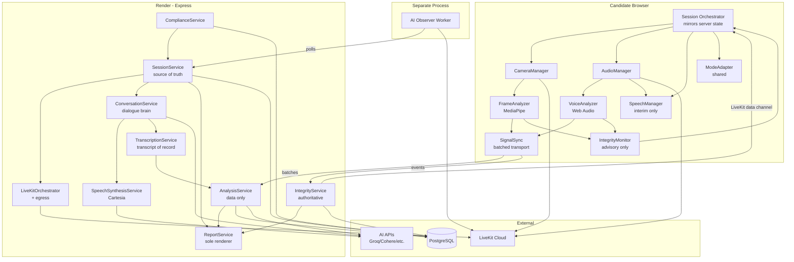
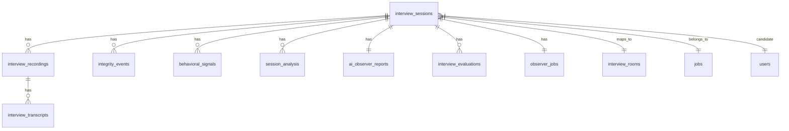

# Unified Interview Engine — Architecture

> **Status:** Draft v2 | **Version:** 2 | **Owner:** Sumanth | **Architect:** Rex
> **PRD:** `docs/sdlc/rekrut-ai-v2/02-planning/unified-interview-engine/prd.md` (v2.1, approved)
> **Review:** Specialist findings from database-reviewer, security-reviewer, and plan-eng-review incorporated. See Changelog.

---

## Changelog (v1 → v2)

### Specialist Review Findings Incorporated

| # | Finding | Source | Change |
|---|---------|--------|--------|
| 1 | No component owns the conversational loop | eng-review 🔴 C1 | **Added `ConversationService`** (3.16) — server-side dialogue loop |
| 2 | No TTS producer for AI voice | eng-review 🔴 C2 | **Added `SpeechSynthesisService`** (3.17) — Cartesia primary |
| 3 | No transcript of record | eng-review 🔴 C3 | **Added `TranscriptionService`** (3.18) — server-side STT with fallback chain |
| 4 | Integrity trust model inverted | eng-review 🔴 C4 | **Split advisory vs authoritative** — client fusion is untrusted advisory; server runs independent fusion. Server issues challenges, verifies responses. |
| 5 | AIObserverService dies on deploy | eng-review 🔴 C5 | **Moved to separate worker process** (`workers/ai-observer/`), driven by `observer_jobs` table |
| 6 | Three components claim report generation | eng-review 🔴 C6 | **One-way data flow enforced** — AnalysisService emits data, ReportService is sole renderer |
| 7 | No signal batch transport | eng-review 🟡 I1 | **Added `SignalSync`** client module — batches every 5s, exponential backoff, `signal_gap` markers |
| 8 | No session rehydration | eng-review 🟡 I2 | **Server is source of truth** — SessionService persists turn state + heartbeat; client rehydrates on load |
| 9 | ModeAdapter client-only | eng-review 🟡 I3 | **Moved to shared module** (`shared/interview-modes/`) importable by both sides |
| 10 | No auth on signal POST endpoints | security 🔴 C-1 | **Session-scoped JWT** on all POST endpoints; body session-id must match token claim |
| 11 | Audit log not append-only | db 🔴 F1 + security 🔴 C-2 | **Added trigger** blocking UPDATE/DELETE; app role gets INSERT/SELECT only |
| 12 | MFA has no design | security 🔴 C-3 | **Added TOTP MFA** via `otplib`; `mfa_verified` JWT claim checked per-request |
| 13 | LLM sharing violates CR-09 | security 🔴 C-4 | **Sanitizer** — only text transcripts + aggregates sent to LLMs; DPA requirements documented |
| 14 | Key management unspecified | security 🟡 I-1 | **Per-candidate HKDF** key derivation, copying `lib/document-crypto.js` pattern |
| 15 | ID photo deletion not crash-safe | security 🟡 I-2 | **R2/B2 lifecycle rule** backstop + `expires_at` column |
| 16 | Missing CHECK constraints | db 🟡 F3 | Added CHECKs for severity, event_type, modality, action, user_role, confidence |
| 17 | Redundant indexes | db 🟡 F2, F4 | Composite `(interview_session_id, started_at_ms)`; dropped `idx_behavioral_session`; partial severity index |
| 18 | Score scales undefined | db 🟡 F5 | **Fixed: 0–100 scale** for all scores; added range CHECKs |
| 19 | `started_at_ms` ambiguous | db 🟡 F6 | **Clarified: milliseconds offset from session start**; renamed columns to `offset_start_ms` / `offset_end_ms` |
| 20 | Partitioning claim inaccurate | db 🟡 F8 | **Dropped the claim** — not needed at 100 sessions; documented as future work |

### Open Questions Resolved by Rex

| # | Question | Decision |
|---|----------|----------|
| 1 | Score scale (DB reviewer) | **0–100** for all scores (consistent with ID match score) |
| 2 | `started_at_ms` semantics (DB reviewer) | **Session-relative offset in ms**; renamed to `offset_start_ms` |
| 3 | `session_analysis` upsert vs history (DB reviewer) | **Upsert** (latest-wins per question) |
| 4 | `livekit_room_name` as lookup key (DB reviewer) | **Yes** — observer worker needs it; index added |
| 5 | Server→client push channel (eng reviewer) | **LiveKit data channel** (no new infra, $0) |
| 6 | Screening TTS: pre-generated or on-demand? (eng reviewer) | **Pre-generated** at question-authoring time (standardized questions) |
| 7 | Server-side frame sampling as cross-check? (eng reviewer) | **Out of scope for v1** — accepted $0 tradeoff; noted as future work |

### Open Questions for Suga/Sumanth

| # | Question | Why Rex can't decide |
|---|----------|---------------------|
| 1 | Groq/Cohere free-tier DPA terms — do they permit zero-retention? | Legal/commercial, needs Sumanth |
| 2 | LiveKit Cloud DPA posture | Legal/commercial, needs Sumanth |
| 3 | Exact `event_type` vocabulary for integrity events | Product decision — recommend Sumanth/Aria confirm the list in PRD |

---

## 1. System Overview

*(Unchanged from v1 — approved)*

The Unified Interview Engine is a modular subsystem within the Rekrut AI v2 monolith that orchestrates all four interview modes (Mock, AI Screening, AI Interview, Human + AI Observer) through a single configurable pipeline. It handles real-time voice/video via LiveKit, in-browser ML inference via MediaPipe and Web Audio API, and server-side orchestration via Express.js — with all integrity and behavioral analysis producing evidence for human recruiter review.

### System Type

**Modular monolith subsystem.** The engine lives inside the existing Rekrut AI v2 Express + React monolith as a well-bounded module (`client/src/engine/interview/`, `server/services/interview-engine/`), not a separate service. This avoids the operational overhead of microservices while enforcing clean module boundaries through Zod-validated interfaces.

### Deployment Target

**Render (existing).** No new infrastructure. The engine deploys as part of the existing Render web service, plus one lightweight worker process for the AI Observer. LiveKit Cloud (already integrated) handles real-time media. All ML inference runs either in-browser (MediaPipe WASM, TensorFlow.js) or on the existing Node.js server — zero additional cost.

### Scale & Availability

| Dimension | Target | Rationale |
|-----------|--------|-----------|
| Concurrent sessions | 100 | PRD NFR-03; single Render instance handles this with LiveKit offloading media |
| Turn-taking latency | <2s p99 | PRD NFR; AI response generation is the bottleneck, not infrastructure |
| Voice analysis | <100ms per turn | In-browser eGeMAPS extraction, no server round-trip |
| Video frame processing | <500ms | MediaPipe WASM on client, throttled to 2fps for analysis |
| LLM calls per session | Budgeted (see §3.16) | $0 constraint requires explicit call budget |
| Uptime | 99.5% | PRD NFR-04; inherits from Render SLA |
| Data volume | ~500MB per 1,000 interviews | Transcripts + embeddings + signals (video deleted after 90 days) |

### Key Constraints

- **$0 additional infrastructure.** No new paid services, no GPU instances, no separate ML serving layer.
- **Browser-first ML.** MediaPipe Tasks (WASM), TensorFlow.js, and Web Audio API run on the candidate's device. Server does orchestration, not inference.
- **LiveKit for media.** All real-time audio/video goes through LiveKit (already integrated). The engine never handles raw RTC.
- **Compliance by architecture.** Biometric data segregation, encryption, auto-deletion, and audit logging are structural requirements, not bolt-ons.
- **Trust model: server verifies.** Client-side analysis is advisory only. The server independently fuses signals and verifies challenge responses. (ADR-002)

---

## 2. Architecture Pattern

*(Unchanged from v1 — approved)*

**Chosen:** Modular Monolith with Client-Side Intelligence

The interview engine is a set of well-bounded modules inside the existing Rekrut AI v2 monolith, with heavy computation pushed to the client (candidate's browser). The server orchestrates; the client analyzes.

**Rationale:**
- **$0 budget** eliminates microservices (no budget for service mesh, inter-service networking, or additional Render instances).
- **Team size** (Sumanth + Suga + subagents) cannot operate distributed systems reliably.
- **100 concurrent sessions** does not require horizontal scaling of business logic — LiveKit handles media scaling.
- **Browser ML** (MediaPipe WASM, TF.js) is mature enough that server-side inference is unnecessary for our accuracy targets.
- **Existing codebase** is already a modular monolith — the engine follows the established pattern.

**Alternatives Considered:**
| Alternative | Why Rejected |
|-------------|--------------|
| Microservices (interview-service, integrity-service, analysis-service) | Operational overhead exceeds team capacity. Network latency between services would break <100ms voice analysis target. $0 budget prohibits additional infrastructure. |
| Serverless (Lambda for analysis) | Cold starts break real-time requirements. No budget for provisioned concurrency. Vendor lock-in risk. |
| Separate ML inference server (Python/FastAPI) | Adds deployment complexity, another service to monitor, Python/Node interop overhead. Browser WASM achieves sufficient accuracy for our targets. |

**Trade-offs:**
- We accept: Single deployment unit (one bad deploy affects everything). Limited to vertical scaling of the Node server.
- We gain: Simple deployment, no network hops for orchestration, $0 cost, team can reason about the whole system.
- Mitigation: Strict module boundaries via Zod-validated interfaces; engine modules have no direct DB access (go through repository layer).

---

## 3. Component Design

### Client Components (`client/src/engine/interview/`)

#### 3.1 Session Orchestrator (Client)
- **Responsibility:** Mirrors server turn state; manages UI flow on the candidate's device.
- **Owns:** UI state (current view, timer display, challenge prompts).
- **Does NOT own:** Authoritative turn state (that's ConversationService 3.16). Client timer is display-only.
- **Interface:** `startSession(config)`, `syncState()`, `pause()`, `resume()`, `complete()`
- **Tech:** TypeScript state machine. Rehydrates from `GET /sessions/:id/state` on load.
- **Revised (v2):** Was the turn-state owner; now mirrors server state per eng-review I2.

#### 3.2 CameraManager
- **Responsibility:** Camera lifecycle — acquire, attach, reattach on element change, release.
- **Owns:** MediaStream, video element binding.
- **Does NOT own:** Analysis (that's FrameAnalyzer). Consent gating (that's SessionOrchestrator).
- **Interface:** `acquire()`, `attachTo(element)`, `reattach()`, `release()`, `getStream()`, `getState()`, `isAvailable()`
- **Tech:** Extends existing `useInterviewCamera` hook. Fixes video bug via callback ref pattern.
- **Constraint:** `acquire()` MUST NOT run before consent receipt exists (eng-review I4).

#### 3.3 AudioManager
- **Responsibility:** Microphone lifecycle + AI voice playback.
- **Owns:** Mic stream, audio element, TTS playback queue.
- **Does NOT own:** Speech recognition (that's SpeechManager), voice analysis (that's VoiceAnalyzer), TTS synthesis (that's SpeechSynthesisService 3.17).
- **Interface:** `startMic()`, `stopMic()`, `playAIResponse(audioUrl)`, `setVolume()`, `getState()`, `isAvailable()`
- **Tech:** Extends `useInterviewerAudio`. Web Audio API for analysis tap. Server-generated audio via `HTMLAudioElement` (proven iOS path).

#### 3.4 SpeechManager
- **Responsibility:** Interim speech-to-text for UX responsiveness.
- **Owns:** Recognition session, interim transcript buffer.
- **Does NOT own:** Transcript of record (that's TranscriptionService 3.18).
- **Interface:** `startListening()`, `stopListening()`, `onInterimTranscript(callback)`
- **Tech:** Extends `useSpeechRecognition` (Web Speech API). Interim only — never the record.
- **Revised (v2):** Downgraded from transcript owner to interim-UX per eng-review C3.

#### 3.5 FrameAnalyzer (Client ML)
- **Responsibility:** In-browser video analysis at 2fps.
- **Owns:** MediaPipe pipelines, frame sampling, signal emission.
- **Does NOT own:** Decision-making (sends signals to server).
- **Interface:** `analyzeFrame(videoElement)` → emits `VisualSignal` events via SignalSync
- **Tech:** MediaPipe Tasks Vision (FaceLandmarker, 478 landmarks). Apache-2.0. WASM.
- **Outputs:** Gaze direction, head pose, facial landmarks, blink rate, lip landmarks.
- **Degraded mode:** Emits `signal_unavailable` with reason if MediaPipe fails to load (eng-review I6).

#### 3.6 VoiceAnalyzer (Client ML)
- **Responsibility:** In-browser audio analysis.
- **Owns:** eGeMAPS feature extraction, WPM calculation, filler counting.
- **Does NOT own:** Voice profile comparison (server-side, needs baseline).
- **Interface:** `analyzeAudio(audioBuffer)` → emits `VocalSignal` events via SignalSync
- **Tech:** Web Audio API + Meyda (feature extraction). No heavy deps.
- **Outputs:** F0, intensity, spectral flux, WPM, filler count, pause durations.
- **Degraded mode:** Emits `signal_unavailable` with reason if mic muted/unavailable (eng-review I6).

#### 3.7 IntegrityMonitor (Client — Advisory Only)
- **Responsibility:** Client-side signal fusion for **real-time UX only** (fast challenge triggers). Outputs are advisory and untrusted.
- **Owns:** Advisory fusion, challenge UI rendering, screen-flash test administration.
- **Does NOT own:** Authoritative integrity scoring (that's IntegrityService 3.13). Challenge verification (server verifies).
- **Interface:** `onSignal(signal)`, `evaluateAdvisoryThreat()`, `renderChallenge(type)`
- **Tech:** Hand-rolled fusion engine. Conservative thresholds (≥0.85 confidence, 3+ signals).
- **Trust model:** Client fusion NEVER drives report scores. Server independently fuses and scores. (ADR-002)
- **Revised (v2):** Was authoritative; now advisory per eng-review C4.

#### 3.8 ModeAdapter (Shared)
- **Responsibility:** Configures engine behavior per interview mode.
- **Owns:** Mode-specific question flow, integrity level, behavioral depth, visibility rules.
- **Does NOT own:** Core engine logic.
- **Interface:** `getConfig(mode)` → returns validated `InterviewConfig`
- **Tech:** Zod schemas. Pure functions, no state.
- **Location:** `shared/interview-modes/` — importable by both client and server (eng-review I3).
- **Revised (v2):** Moved from client-only to shared module.

#### 3.9 SignalSync (Client)
- **Responsibility:** Batched, reliable signal transport to server.
- **Owns:** Signal buffer, batching, retry logic, gap marking.
- **Interface:** `enqueue(signal)`, `flush()`
- **Tech:** Batches every ~5s. Exponential-backoff retry. Drop-oldest on overflow with explicit `signal_gap` marker.
- **Added (v2):** New component per eng-review I1. Replaces naive per-signal POSTs (~400 req/s → ~40 req/s at 100 sessions).

### Server Components (`server/services/interview-engine/`)

#### 3.10 SessionService
- **Responsibility:** CRUD for interview sessions, lifecycle management, **authoritative turn state**.
- **Owns:** `interview_sessions` table, invite tokens, state transitions, consent receipts, turn state + heartbeat.
- **Does NOT own:** Media (LiveKit), analysis (AnalysisService), dialogue (ConversationService).
- **Interface:** REST API (`POST /api/interview-sessions`, `PATCH /:id/state`, `GET /:id/state`, etc.)
- **Tech:** Express routes + pg. Follows existing route patterns.
- **Revised (v2):** Now persists `{questionIndex, turnState, elapsedMs, consentReceipt, transcriptCursor}` on every turn + heartbeat (eng-review I2). Enqueues observer jobs.

#### 3.11 LiveKitOrchestrator
- **Responsibility:** Room creation, token generation with identity prefixes, AI Observer dispatch, **recording egress**.
- **Owns:** LiveKit room lifecycle, participant identity mapping, egress artifacts.
- **Does NOT own:** Media processing.
- **Interface:** `createRoom(sessionId)`, `getToken(userId, role)`, `dispatchObserver(sessionId)`, `startEgress(sessionId)`, `stopEgress(sessionId)`
- **Tech:** Extends `server/services/livekit.js`. Identity: `candidate-{id}`, `interviewer-{id}`, `ai-observer-{sessionId}`.
- **Revised (v2):** Now owns recording egress lifecycle per eng-review I5. Token issuance MUST verify session membership (invite token → role → prefixed identity).

#### 3.12 AnalysisService
- **Responsibility:** Server-side behavioral fusion, linguistic forensics. Emits structured data (not prose).
- **Owns:** `behavioral_signals`, `session_analysis` tables. Independent server-side signal fusion.
- **Does NOT own:** Report rendering (that's ReportService). Real-time signal collection (that's client).
- **Interface:** `ingestSignalBatch(batch)`, `fuseSignals(sessionId)`, `runLinguisticForensics(transcriptId)`, `getSessionAnalysis(sessionId)`
- **Tech:** Node.js. LLM calls for linguistic analysis (via existing AI_KEYS_JSON). **Sanitizer:** only text transcripts + aggregate scores sent to LLMs, never raw biometric features (security C-4).
- **Revised (v2):** Now runs independent server-side fusion (eng-review C4). Emits data only, per eng-review C6.

#### 3.13 IntegrityService
- **Responsibility:** Authoritative integrity event storage, independent threat scoring, recruiter timeline.
- **Owns:** `integrity_events` table. Server-side fusion engine.
- **Does NOT own:** Real-time detection (that's client IntegrityMonitor, advisory).
- **Interface:** `recordEvent(event)`, `ingestSignalBatch(batch)`, `runIndependentFusion(sessionId)`, `getTimeline(sessionId)`, `calculateThreatScore(sessionId)`, `issueChallenge(sessionId, type)`, `verifyChallengeResponse(sessionId, responseData)`
- **Tech:** Express + pg. Conservative scoring (≥0.85 confidence, 3+ corroborating signals).
- **Revised (v2):** Now runs independent fusion and verifies challenge responses (eng-review C4). Issues challenges via LiveKit data channel.

#### 3.14 ComplianceService
- **Responsibility:** Retention automation, deletion workflows, audit logging, consent management.
- **Owns:** Deletion cron, audit log table, consent records.
- **Does NOT own:** Business logic. Recording artifacts (that's LiveKitOrchestrator).
- **Interface:** `runRetentionPurge()`, `handleDeletionRequest(candidateId)`, `logAccess(entry)`, `getComplianceStatus()`, `checkConsent(sessionId, consentType)`
- **Tech:** node-cron for scheduled purges. Append-only audit log (trigger-enforced).
- **Revised (v2):** INSERT paths in Integrity/AnalysisService MUST check consent before persisting (security I-6). Uses per-candidate HKDF keys for crypto-erasure (security I-9).

#### 3.15 ReportService (Sole Renderer)
- **Responsibility:** **Sole** renderer of both report views. **Sole** enforcer of per-mode visibility rules.
- **Owns:** Report templates, PDF generation (if needed), visibility logic.
- **Does NOT own:** Analysis data (reads from AnalysisService + IntegrityService, one-way).
- **Interface:** `generateRecruiterReport(sessionId)`, `generateCandidateReport(sessionId, mode)`
- **Tech:** React server components or Handlebars templates.
- **Data flow (one-way, enforced):** `ReportService → AnalysisService` reads; never the reverse (eng-review C6).
- **Security:** Candidate reports MUST exclude integrity internals server-side (security I-5). Cross-tenant scoping via `company_id` enforced with existing `rbac.js`.

#### 3.16 ConversationService (NEW)
- **Responsibility:** AI interviewer's conversational brain. Owns the dialogue loop.
- **Owns:** Question plan generation (mode config + JD + resume), follow-up vs. move-on decisions, authoritative turn state transitions, integrity probe generation.
- **Does NOT own:** TTS synthesis (that's SpeechSynthesisService). STT (that's TranscriptionService).
- **Interface:** `buildQuestionPlan(sessionId)`, `getNextTurn(sessionId, answerContext)` → `{type: question|followup|probe, text, audioUrl?}`
- **Tech:** Node.js + LLM (via AI_KEYS_JSON). LLM call budget enforced (see below).
- **LLM Call Budget (per session):** question-plan (1 call), per-turn next-step (1 call, capped at 20 turns), report synthesis (1 call). Screening question plans cached per job. (eng-review I7)
- **Added (v2):** New component per eng-review C1. This is the core of "AI Interview" mode.

#### 3.17 SpeechSynthesisService (NEW)
- **Responsibility:** Text-to-speech for AI interviewer voice.
- **Owns:** TTS provider integration, audio file generation/caching.
- **Interface:** `synthesize(text, voiceId)` → `{audioUrl, durationMs}`
- **Tech:** Cartesia primary (key exists), matching the repo's STT fallback-chain pattern.
- **Screening mode:** Audio pre-generated at question-authoring time (standardized questions). **AI Interview mode:** On-demand synthesis from ConversationService output.
- **Added (v2):** New component per eng-review C2. Client AudioManager plays via `HTMLAudioElement` (proven iOS path).

#### 3.18 TranscriptionService (NEW)
- **Responsibility:** Server-side speech-to-text. The **transcript of record**.
- **Owns:** Audio ingestion (LiveKit track / uploaded chunks), provider fallback chain, word-level timestamps.
- **Does NOT own:** Interim UX transcripts (that's SpeechManager).
- **Interface:** `transcribe(sessionId, audioChunk)` → `{text, words: [{word, startMs, endMs, confidence}]}`
- **Tech:** Existing fallback chain: Whisper → self-hosted → Groq → Deepgram → Cartesia.
- **Rule:** Server transcript is the ONLY transcript `AnalysisService` consumes. No dual transcripts of record. (eng-review C3)
- **Added (v2):** New component per eng-review C3.

### Worker Processes (`workers/`)

#### 3.19 AI Observer Worker
- **Responsibility:** Long-lived LiveKit bot for human interviews. Subscribes to candidate streams, writes raw observations.
- **Owns:** Bot lifecycle, room subscription, observation writes.
- **Does NOT own:** Report generation (that's ReportService). Analysis (that's AnalysisService).
- **Interface:** Polls `observer_jobs` table. `joinRoom(roomName)`, `observe()`, `flushAndExit()`.
- **Tech:** `@livekit/agents`. Separate Node.js process (`workers/ai-observer/`).
- **Lifecycle:** SessionService enqueues job → worker polls → joins room → writes raw observations to DB → exits on session end or SIGTERM (graceful: leave room + flush state).
- **Failure mode:** Queue overflow → explicit "unobserved" marking on session, not silent drop.
- **Revised (v2):** Moved from `server/services/` to separate worker process per eng-review C5. Survives Express restarts.

### Component Diagram (v2)



---

## 4. Data Architecture

### Primary Data Store

**PostgreSQL (Neon)** — existing. All persistent data lives here.
- **Rationale:** Already in use, team knows it, pgvector available for embeddings, JSONB for flexible signal storage.
- **No new databases.** Biometric segregation is achieved via separate tables + per-candidate encryption keys, not separate database instances ($0 constraint).

### Key Management (v2 — NEW)

Per security-reviewer I-1, copying the existing `lib/document-crypto.js` pattern:
- Dedicated `BIOMETRIC_ENCRYPTION_KEY` environment variable (master key).
- Per-candidate data keys derived via HKDF-SHA256(master_key, candidate_id).
- Pattern is fail-secure: throws in production if key is missing.
- **Crypto-erasure:** Deletion = destroy rows + key material → ciphertext in backups becomes unrecoverable (security I-9). Documented as the CR-02 destruction method.

### Core Data Model

**Existing tables (reused):**
| Table | Purpose | Key Fields |
|-------|---------|------------|
| `interview_sessions` | Unified session record | `id`, `type`, `candidate_id`, `job_id`, `status`, `config` JSONB, `conversation` JSONB |
| `interview_recordings` | Media recordings | `id`, `interview_session_id` FK, `recording_url`, `duration` |
| `interview_transcripts` | Word-level transcripts | `id`, `recording_id` FK, `speaker_identity`, `text`, `start_time_ms`, `end_time_ms` |
| `interview_evaluations` | Human interviewer feedback | `id`, `interview_session_id`, scores, notes |
| `interview_rooms` | LiveKit room mapping | `id`, `interview_session_id`, `room_name` |
| `interview_flows` | Recruiter-defined configs | `id`, `company_id`, `job_id`, phases, rubric |

**New tables (v2 — revised per db-reviewer):**

```sql
-- Integrity flag timeline
-- Severity vocabulary: 'info', 'warning', 'critical'
-- Event types: 'gaze_away', 'face_absent', 'multiple_faces', 'tab_switch',
--   'challenge_issued', 'challenge_failed', 'voice_deviation', 'lip_sync_fail',
--   'reading_pattern', 'latency_anomaly', 'zero_hesitation', 'screen_flash_anomaly',
--   'signal_gap', 'signal_unavailable'
CREATE TABLE integrity_events (
  id SERIAL PRIMARY KEY,
  interview_session_id INTEGER NOT NULL REFERENCES interview_sessions(id) ON DELETE CASCADE,
  event_type VARCHAR(50) NOT NULL CHECK (event_type IN (
    'gaze_away', 'face_absent', 'multiple_faces', 'tab_switch',
    'challenge_issued', 'challenge_failed', 'voice_deviation', 'lip_sync_fail',
    'reading_pattern', 'latency_anomaly', 'zero_hesitation', 'screen_flash_anomaly',
    'signal_gap', 'signal_unavailable'
  )),
  severity VARCHAR(20) NOT NULL DEFAULT 'info'
    CHECK (severity IN ('info', 'warning', 'critical')),
  offset_start_ms BIGINT NOT NULL CHECK (offset_start_ms >= 0),
  offset_end_ms BIGINT CHECK (offset_end_ms IS NULL OR offset_end_ms >= offset_start_ms),
  confidence DECIMAL(4,3) CHECK (confidence >= 0 AND confidence <= 1),
  details JSONB DEFAULT '{}',
  created_at TIMESTAMPTZ DEFAULT NOW()
);
CREATE INDEX idx_integrity_session_time ON integrity_events(interview_session_id, offset_start_ms);
CREATE INDEX idx_integrity_sev_time ON integrity_events(severity, created_at)
  WHERE severity IN ('warning', 'critical');

-- Per-turn behavioral signals
-- Modality vocabulary: 'visual', 'vocal', 'linguistic', 'fused'
-- Scores: 0-100 scale for all score fields
CREATE TABLE behavioral_signals (
  id SERIAL PRIMARY KEY,
  interview_session_id INTEGER NOT NULL REFERENCES interview_sessions(id) ON DELETE CASCADE,
  turn_index INTEGER NOT NULL CHECK (turn_index >= 0),
  modality VARCHAR(20) NOT NULL CHECK (modality IN ('visual', 'vocal', 'linguistic', 'fused')),
  signal_type VARCHAR(50) NOT NULL,
  score DECIMAL(5,2) CHECK (score IS NULL OR (score >= 0 AND score <= 100)),
  label VARCHAR(100),
  confidence DECIMAL(4,3) CHECK (confidence IS NULL OR (confidence >= 0 AND confidence <= 1)),
  details JSONB DEFAULT '{}',
  created_at TIMESTAMPTZ DEFAULT NOW(),
  UNIQUE(interview_session_id, turn_index, modality, signal_type)
);
-- No separate session index: UNIQUE leftmost column covers it (db-reviewer F4)

-- AI Observer reports for human interviews
CREATE TABLE ai_observer_reports (
  id SERIAL PRIMARY KEY,
  interview_session_id INTEGER NOT NULL REFERENCES interview_sessions(id) ON DELETE CASCADE,
  livekit_room_name VARCHAR(255),
  observer_identity VARCHAR(255),
  candidate_identity VARCHAR(255),
  analysis JSONB NOT NULL DEFAULT '{}',
  integrity_summary JSONB DEFAULT '{}',
  started_at TIMESTAMPTZ,
  completed_at TIMESTAMPTZ CHECK (completed_at IS NULL OR completed_at >= started_at),
  created_at TIMESTAMPTZ DEFAULT NOW(),
  UNIQUE(interview_session_id)
);
CREATE INDEX idx_observer_room ON ai_observer_reports(livekit_room_name);

-- Unified per-question analysis (replaces legacy interview_analysis)
-- Upsert semantics: latest-wins per (session, question)
-- Scores: 0-100 scale for all score fields
CREATE TABLE session_analysis (
  id SERIAL PRIMARY KEY,
  interview_session_id INTEGER NOT NULL REFERENCES interview_sessions(id) ON DELETE CASCADE,
  question_index INTEGER NOT NULL CHECK (question_index >= 0),
  analysis_data JSONB NOT NULL DEFAULT '{}',
  visual_score DECIMAL(5,2) CHECK (visual_score IS NULL OR (visual_score >= 0 AND visual_score <= 100)),
  vocal_score DECIMAL(5,2) CHECK (vocal_score IS NULL OR (vocal_score >= 0 AND vocal_score <= 100)),
  linguistic_score DECIMAL(5,2) CHECK (linguistic_score IS NULL OR (linguistic_score >= 0 AND linguistic_score <= 100)),
  fused_score DECIMAL(5,2) CHECK (fused_score IS NULL OR (fused_score >= 0 AND fused_score <= 100)),
  created_at TIMESTAMPTZ DEFAULT NOW(),
  updated_at TIMESTAMPTZ DEFAULT NOW(),
  UNIQUE(interview_session_id, question_index)
);

-- Observer job queue (drives the AI Observer worker process)
CREATE TABLE observer_jobs (
  id SERIAL PRIMARY KEY,
  interview_session_id INTEGER NOT NULL REFERENCES interview_sessions(id) ON DELETE CASCADE,
  room_name VARCHAR(255) NOT NULL,
  status VARCHAR(20) NOT NULL DEFAULT 'pending'
    CHECK (status IN ('pending', 'claimed', 'active', 'completed', 'failed', 'unobserved')),
  worker_id VARCHAR(100),
  claimed_at TIMESTAMPTZ,
  completed_at TIMESTAMPTZ,
  error TEXT,
  created_at TIMESTAMPTZ DEFAULT NOW(),
  UNIQUE(interview_session_id)
);
CREATE INDEX idx_observer_jobs_status ON observer_jobs(status) WHERE status = 'pending';

-- Biometric audit log (append-only, trigger-enforced)
-- Action vocabulary: 'view', 'export', 'delete', 'purge'
-- User roles: canonical list from migration 047
CREATE TABLE biometric_audit_log (
  id SERIAL PRIMARY KEY,
  accessed_at TIMESTAMPTZ DEFAULT NOW() NOT NULL,
  user_id INTEGER NOT NULL,
  user_role VARCHAR(50) NOT NULL CHECK (user_role IN (
    'candidate', 'recruiter', 'employer', 'admin', 'hiring_manager'
  )),
  action VARCHAR(20) NOT NULL CHECK (action IN ('view', 'export', 'delete', 'purge')),
  data_type VARCHAR(50) NOT NULL,
  candidate_id INTEGER NOT NULL,
  ip_address INET
);
CREATE INDEX idx_audit_candidate_time ON biometric_audit_log(candidate_id, accessed_at DESC);
CREATE INDEX idx_audit_user ON biometric_audit_log(user_id);
CREATE INDEX idx_audit_time ON biometric_audit_log(accessed_at);

-- Append-only enforcement (db-reviewer F1, security-reviewer C-2)
CREATE OR REPLACE FUNCTION prevent_audit_mutation() RETURNS trigger AS $$
BEGIN
  RAISE EXCEPTION 'biometric_audit_log is append-only: % not allowed', TG_OP;
END;
$$ LANGUAGE plpgsql;
DROP TRIGGER IF EXISTS trg_biometric_audit_log_no_update ON biometric_audit_log;
CREATE TRIGGER trg_biometric_audit_log_no_update
  BEFORE UPDATE OR DELETE ON biometric_audit_log
  FOR EACH ROW EXECUTE FUNCTION prevent_audit_mutation();
-- NOTE: Application role must be granted INSERT/SELECT only (no UPDATE/DELETE/TRUNCATE).
-- TRUNCATE bypasses row triggers — revoke TRUNCATE on this table from all roles.
```

### Entity Relationship Diagram



### Data Flow

```
Candidate Browser                    Server                         Database
     │                                  │                               │
     │── SignalBatch (5s) ─────────────▶│── auth: session JWT ─────────▶│
     │── IntegrityEvent ───────────────▶│── consent check ─────────────▶│
     │                                  │── INSERT behavioral_signals ─▶│
     │                                  │── INSERT integrity_events ───▶│
     │                                  │                               │
     │◀── AI Response (audio+text) ─────│◀── ConversationService ──────│
     │◀── Challenge (data channel) ─────│◀── IntegrityService ─────────│
     │                                  │                               │
     │── Audio chunks ─────────────────▶│── TranscriptionService ──────▶│
     │                                  │── INSERT transcripts ────────▶│
     │                                  │                               │
     │                                  │── AnalysisService fuses ─────▶│
     │                                  │── INSERT session_analysis ──▶│
     │                                  │── ReportService renders ─────▶│
```

### Caching

**Redis** (already available via Render) for:
- Session state (for future horizontal scaling — ADR-001)
- Voice baseline profiles (60-second eGeMAPS, TTL = session duration)
- Rate limiting counters
- Screening question plans (cached per job — eng-review I7)

**Not cached:** Integrity events, behavioral signals, audit log (must be persistent immediately).

### ID Photo Handling (v2 — crash-safe)

Per security-reviewer I-2:
1. Upload → R2/B2 `id-verification/` prefix with **lifecycle rule: auto-delete after 1 day**.
2. Extract embedding → compare → store match score.
3. Application cron purges within 24h (primary path).
4. Lifecycle rule is the backstop (survives server crashes).
5. `expires_at` column on the tracking record; alert if zero-deletes in a purge run.

---

## 5. API Design

**Protocol:** REST (JSON). Real-time server→client push via LiveKit data channel (no new infra).

**Authentication:** Session-scoped JWT (see §6). Every signal/event POST carries a JWT with `session_id` claim; body `session_id` MUST match. Reuses existing `lib/auth` `authMiddleware`.

**Versioning:** URL versioning (`/api/v1/...`). v1 is the initial interview engine API.

### Key Endpoints

| Method | Endpoint | Auth | Description |
|--------|----------|------|-------------|
| POST | `/api/v1/interview-sessions` | Recruiter JWT | Create session (validates config via Zod) |
| GET | `/api/v1/interview-sessions/:id` | Session or recruiter JWT | Get session details |
| GET | `/api/v1/interview-sessions/:id/state` | Session JWT | **Rehydration** — turn state, question index, elapsed, consent receipt |
| PATCH | `/api/v1/interview-sessions/:id/state` | Session JWT | Update turn state (heartbeat) |
| POST | `/api/v1/interview-sessions/:id/invite` | Recruiter JWT | Generate invite token |
| POST | `/api/v1/interview-sessions/:id/signal-batches` | Session JWT | Ingest batched signals (5s batches) |
| POST | `/api/v1/interview-sessions/:id/integrity-events` | Session JWT | Record integrity event (advisory) |
| POST | `/api/v1/interview-sessions/:id/transcript-chunks` | Session JWT | Upload audio for transcription |
| GET | `/api/v1/interview-sessions/:id/next-turn` | Session JWT | ConversationService: get next AI turn |
| POST | `/api/v1/interview-sessions/:id/challenge-response` | Session JWT | Submit challenge response for server verification |
| GET | `/api/v1/interview-sessions/:id/report/recruiter` | Recruiter JWT + MFA | Full report (scores + integrity + transcript) |
| GET | `/api/v1/interview-sessions/:id/report/candidate` | Candidate JWT | Qualitative feedback (per-mode visibility rules) |
| POST | `/api/v1/interview-sessions/:id/consent` | Session JWT | Record consent receipt (3 separate types) |
| DELETE | `/api/v1/candidates/:id/biometric-data` | Candidate JWT | "Delete my data" request |
| GET | `/api/v1/admin/compliance/status` | Admin JWT + MFA | Retention status, pending deletions |
| POST | `/api/v1/admin/compliance/purge` | Admin JWT + MFA | Manual purge trigger |

### Error Handling

- Standard HTTP status codes. `400` with Zod validation details. `401`/`403` for auth failures (logged to audit log).
- Signal ingest failures: client retries with backoff; server returns `202 Accepted` (async processing).
- All errors include `requestId` for tracing.

---

## 6. Security Architecture

### Authentication
- **Candidates:** Invite token → short-lived session JWT (`session_id`, `candidate_id`, `role=candidate`, 4h TTL). Re-minted on rejoin.
- **Recruiters/Admins:** Existing session auth + **TOTP MFA** (`otplib`, $0) for biometric data access.
- **MFA enforcement:** `mfa_verified` JWT claim (15-min TTL) checked **per-request** on biometric routes, not just at login. Step-up re-challenge for report views. Missing claim → `403` + audit-logged denial. (security C-3)
- **AI Observer worker:** Server-minted LiveKit tokens, least-privilege grants (subscribe-only, single room, 1h TTL). Webhook signature validation.

### Authorization
- **Model:** RBAC via existing `middleware/rbac.js`.
- **Cross-tenant:** All queries scoped by `company_id`. Recruiter can only access own company's sessions.
- **Candidate IDOR:** Candidate JWT contains `candidate_id`; can only access own sessions and own candidate report.
- **Report endpoints:** `dataAccessAudit` middleware on all biometric routes. Candidate report generation strips integrity internals server-side.

### Data Protection
- **In transit:** TLS 1.3 minimum (verify on Render + Neon — security S-1).
- **At rest:** AES-256-GCM for biometric templates. Pattern copied from `lib/document-crypto.js` (fail-secure in production).
- **Key management:** `BIOMETRIC_ENCRYPTION_KEY` env var (master). Per-candidate keys derived via HKDF-SHA256(master, candidate_id). (security I-1)
- **JSONB `details` fields:** Minimized (derived events, not raw series). Anything persisting raw vectors encrypted with per-candidate key. (security I-4)

### Input Validation
- **Boundary:** Zod schemas on every API input. Session JWT claim validated against body `session_id`.
- **LLM inputs:** Untrusted transcript content delimited from system prompts (OWASP LLM01). Structured-output responses. LLM output NEVER drives verdicts or access control. (security I-7)
- **Signal batches:** Schema-validated; `signal_gap` markers for missing data (never interpolated).

### Secrets Management
- All secrets in environment variables. No hardcoding (verified by security reviewer).
- New: `BIOMETRIC_ENCRYPTION_KEY`, LiveKit API keys (existing).

### Audit Logging
- `biometric_audit_log` table (trigger-enforced append-only).
- Every biometric access: `[timestamp] [user_id] [role] [action] [data_type] [candidate_id] [ip]`.
- Application role: INSERT/SELECT only. TRUNCATE revoked.
- Retained 7 years.

### Third-Party Data Sharing (security C-4)
- **LLM sanitizer:** Only text transcripts + aggregate scores sent to Groq/Cohere. NEVER raw eGeMAPS features, emotion vectors, or gaze coordinates. Enforced by tested sanitizer function.
- **DPAs required** before launch: Groq, Cohere, LiveKit Cloud, R2/B2. (Open: free-tier DPA terms — needs Sumanth/legal.)
- Every third-party transmission logged for CR-09 audit.

---

## 7. Observability

### Logging
- Structured JSON logs (pino or existing pattern). `[component]` prefix convention retained.
- **PII rule:** NEVER log transcripts, embeddings, or raw biometric features. Log IDs and metadata only.
- Centralized: existing Sentry integration for errors.

### Metrics
| Metric | Target | Alert threshold |
|--------|--------|-----------------|
| Turn-taking latency p99 | <2s | >3s for 5 min |
| Signal ingest error rate | <1% | >5% over 1 hour |
| Integrity pipeline latency | <2x baseline | >2x for 30 min |
| LLM calls per session | Within budget | Budget exceeded |
| Concurrent sessions | <100 | >300 (ADR-001 scaling trigger) |
| Observer worker queue depth | <10 | >50 (overflow risk) |
| MediaPipe load failure rate | <2% | >10% |

### Tracing
- `requestId` propagated through all services. Correlate client signals → server processing → DB writes.

### Alerting
- Integrity system anomalies → admin alert (FR-55).
- Zero-deletes in purge run → alert (ID photo backstop monitoring).
- MFA failures spike → security alert.

---

## 8. Infrastructure and Deployment

### Current (100 sessions)

| Component | Hosting | Notes |
|-----------|---------|-------|
| Express API | Render (existing) | No change |
| React client | Render static (existing) | No change |
| PostgreSQL | Neon (existing) | 6 new tables via migration |
| Redis | Render (existing) | Session state, rate limits, plan cache |
| LiveKit | LiveKit Cloud (existing) | Rooms, media, data channel |
| AI Observer worker | Render (new process) | `workers/ai-observer/` — lightweight, polls `observer_jobs` |
| Cron (compliance) | node-cron in Express | Retention purges, idempotent, batched |
| Object storage | R2/B2 (existing) | Recordings, ID photos (lifecycle rules) |

**New infrastructure cost: $0.** Worker process runs on existing Render instance. No new services.

### Deployment Process
- Standard: `feature → dev → staging → main` (existing pipeline).
- Worker process deploys with the main service (same repo, same pipeline).
- Migration runs before deploy (existing `migrate.js` pattern).
- **AI Observer worker and Express are independently restartable.** Worker polls `observer_jobs`; Express restart doesn't kill observations (eng-review C5).

### Rollback
- Database migrations are additive (`IF NOT EXISTS`). Rollback = deploy previous code; new tables remain (empty).
- Feature flag: `interview_engine_enabled` per mode for gradual rollout.

---

## 9. Architecture Decision Records (ADRs)

### ADR-001: Scaling to 10,000 Concurrent Sessions

*(Unchanged from v1)*

**Date:** 2026-10-10
**Status:** Planned (not yet needed)
**Context:** Current architecture targets 100 concurrent sessions. Sumanth asked: what if we hit 10,000?

**Decision:** Do NOT build for 10,000 now. Instead, design for clean extraction later.

**Scaling breakpoints:**
| Sessions | Breaks | Fix |
|----------|--------|-----|
| 500 | Node.js event loop | Horizontal: 2-3 instances + LB |
| 1,000 | PG connections | PgBouncer + read replica |
| 2,000 | LiveKit Cloud cost (~$3K/mo) | Self-hosted LiveKit cluster |
| 5,000 | AI API rate limits | Request queuing + caching |
| 10,000 | All above | Full plan below |

**10K architecture (when needed):**
1. **Media:** Self-hosted LiveKit cluster (5-10 media servers, TURN, Redis). Cost: ~$2K-5K/mo vs $15K+ on Cloud.
2. **App:** Stateless engine — 10-20 Node instances behind LB. Session state in Redis, not memory.
3. **DB:** PgBouncer + read replicas + monthly partitioning on `integrity_events` / `behavioral_signals`.
4. **AI:** Request queue with priority, response caching, fallback chain.
5. **Client ML:** No change needed — runs on candidate devices, scales for free.

**What we do NOW (zero cost):**
- Engine is stateless — no in-memory session state
- Strict module boundaries via Zod-validated interfaces
- DB schemas use TIMESTAMPTZ throughout (partitioning-compatible if ever needed)
- This ADR documents the plan

**Consequences:**
- Positive: No premature optimization; clear migration path; $0 budget maintained.
- Negative: Will require DevOps investment when scaling (estimated 2-4 weeks at 500-session threshold).
- Risk: Sudden viral growth could hit limits before migration. Mitigation: monitoring alerts at 300 concurrent sessions.

### ADR-002: Server-Verified Integrity Trust Model

**Date:** 2026-10-10
**Status:** Accepted
**Context:** The original design had the client fusing integrity signals and the server scoring the fused output. The client runs on the candidate's machine — the attacker's machine. A sophisticated cheater could patch the client fusion and the server would bless the tampered result.

**Decision:** Split advisory vs. authoritative.
- Client `IntegrityMonitor` performs fusion for **real-time UX only** (fast challenge triggers). Its output is labeled untrusted.
- Server `IntegrityService` ingests raw signal batches and runs **independent fusion + scoring** for the report.
- Server issues challenges (random timing/pattern via LiveKit data channel). Client administers. **Server verifies the response** from uploaded frames/audio.

**Alternatives considered:**
| Alternative | Why rejected |
|-------------|--------------|
| Trust client fusion entirely | Attacker controls the client; no integrity guarantee |
| Move all fusion server-side | Adds latency (signal upload → server fusion → challenge); breaks real-time UX. Also increases server compute cost. |
| Code obfuscation / anti-tamper on client | Security through obscurity; determined attacker bypasses it |

**Consequences:**
- Positive: Integrity evidence is trustworthy for recruiter review. Real-time UX preserved.
- Negative: Duplicated fusion logic (client + server). Server needs signal batch ingest pipeline.
- Trade-off accepted: correctness over DRY for the security-critical path.

### ADR-003: Server-Side Transcript of Record

**Date:** 2026-10-10
**Status:** Accepted
**Context:** Client Web Speech API is unreliable (proven on Sumanth's iPhone test path). The repo already has a server-side STT fallback chain (Whisper → self-hosted → Groq → Deepgram → Cartesia). Two transcripts of record would create consistency nightmares for linguistic forensics.

**Decision:** `TranscriptionService` (server-side) produces the **single transcript of record** from session audio. Client `SpeechManager` provides interim transcripts for UX responsiveness only.

**Consequences:**
- Positive: Reliable transcripts. Linguistic forensics operates on consistent input. Reuses existing fallback chain.
- Negative: Transcription latency (async). Interim and final transcripts may differ slightly (acceptable — interim is UX-only).

### ADR-004: TOTP MFA for Biometric Access

**Date:** 2026-10-10
**Status:** Accepted
**Context:** PRD CR-08 requires MFA for admin access to biometric data. Zero MFA code exists in the repo.

**Decision:** TOTP via `otplib` ($0, no external service). `mfa_verified` JWT claim (15-min TTL) checked **per-request** on biometric routes — not just at login (survives session hijack). Step-up re-challenge for report views.

**Alternatives considered:**
| Alternative | Why rejected |
|-------------|--------------|
| SMS-based MFA | Costs money per SMS. $0 budget. |
| Hardware keys (WebAuthn) | Great security, but adoption friction for recruiters. TOTP is sufficient. |
| Login-time MFA only | Doesn't survive session hijack. Per-request claim is stronger. |

### ADR-005: AI Observer as Separate Worker Process

**Date:** 2026-10-10
**Status:** Accepted
**Context:** The AI Observer is a LiveKit bot — a long-lived WebSocket subscriber. If placed in `server/services/`, every Express restart (deploy, crash, Render cycling) kills mid-interview observation with no recovery.

**Decision:** Separate Node.js worker process (`workers/ai-observer/`), driven by `observer_jobs` table. SessionService enqueues; worker polls, joins, writes raw observations, exits. Handles SIGTERM gracefully.

**Consequences:**
- Positive: Survives Express restarts. Independent scaling. Clear failure mode (queue overflow → "unobserved" marking).
- Negative: One more process to deploy/monitor. Inter-process communication via DB polling (simple, reliable).
- Cost: $0 (runs on existing Render instance).

### ADR-006: Shared Mode Configuration Module

**Date:** 2026-10-10
**Status:** Accepted
**Context:** `ModeAdapter` was client-only, but `ReportService` (visibility rules) and `IntegrityService` (thresholds) both need mode config on the server. Duplicated Zod schemas would drift apart.

**Decision:** Mode schemas + visibility rules live in `shared/interview-modes/`, importable by both client and server. Pure functions + Zod.

**Consequences:**
- Positive: Single source of truth. Contract tested.
- Negative: Build tooling must handle shared imports (Vite + Node). Standard practice, low risk.
