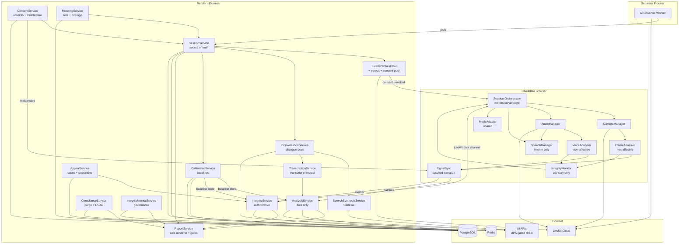

# Unified Interview Engine — Architecture

> **Status:** Draft v3 | **Version:** 3 | **Owner:** Sumanth | **Architect:** Rex
> **PRD:** `docs/sdlc/rekrut-ai-v2/02-planning/unified-interview-engine/prd.md` (v3.0, approved — all 8 OQs resolved)
> **Review:** v3 incorporates findings from 4 specialists (database, security, eng-review, backend-architect). See Changelog.

---

## Changelog (v2 → v3)

### Sumanth's OQ Decisions Incorporated (all 8 resolved 2026-10-10)

| OQ | Decision | Architectural Impact |
|----|----------|---------------------|
| OQ-1 | Judge-first workflow approved | Two-stage reports; `judgments` + `judgment_history` tables; `requireJudgment` service-layer gate |
| OQ-2 | No integrity score | `calculateThreatScore()` removed; observations grouped by severity only |
| OQ-3 | **No emotion inference** (observe, don't label) | Non-affective signal vocabulary only; `signal_type` CHECK allowlist; emotion redaction filter on LLM outputs |
| OQ-4 | 2× subgroup flag ratio alert bar | IntegrityMetricsService alert thresholds |
| OQ-5 | Accommodation mode **private** | `accommodation_modes.mode_selected` hidden from recruiters; two-role DB pattern; boolean-only exposure |
| OQ-6 | Uncertain band (0.60–0.85) at launch, simpler fusion | `getUncertainQueue()` query over `integrity_events`; quality-weighted fusion deferred (ADR-009) |
| OQ-7 | USA + India first, Europe phase 2 | Region attribute on sessions; architecture supports all three; no EU-only features built yet |
| OQ-8 | Hybrid pricing approved | MeteringService: tiers, India ₹199 PAYG, $1.50 overage |

### Specialist Findings Incorporated (v3)

| # | Finding | Source | Disposition |
|---|---------|--------|-------------|
| 1 | `consent_receipts` needs version source-of-truth | db 🔴 C1 | Added `consent_texts` table (FK + Hindi text for CR-10) |
| 2 | `flag_reviews` mutable, no dedup | db 🔴 C2 | Renamed `integrity_event_reviews`; append-only trigger; UNIQUE(event, reviewer) |
| 3 | CASCADE on flag_reviews destroys FP dataset | db 🔴 C3 | Dismissal = visibility filter, never hard delete; `ON DELETE RESTRICT` |
| 4 | `usage_metering` missing FK, counters ambiguous | db 🔴 C4 | FK to companies; started/completed counters; month normalization |
| 5 | Accommodation privacy needs DB-level enforcement | db 🟡 I1 | Two-role + SET ROLE pattern; mode-agnostic threshold keys |
| 6 | PRD §9.2 contradicts OQ-3 (`facial_expression`, `voice_stress`) | db 🟡 I2 + sec 🔴 + eng 🔴 | **PRD v3.1 correction required** (Aria). Schema uses non-affective allowlist; flagged prominently |
| 7 | Missing: uncertain queue, quarantine, base rates | db 🔴 M1/M2/M3 | Uncertain queue = query (eng reviewer); `signal_quarantine` + `flag_base_rates` tables added |
| 8 | Consent middleware: TOCTOU, version race, 403 oracle | sec 🟡 | Live DB lookup per request (no cache); `CONSENT_RENEWAL_REQUIRED` distinct code; strict middleware ordering |
| 9 | PRD FR-49 example violates FR-28/29 ("stress indicators elevated") | sec 🔴 | Flagged for PRD v3.1; banned-word + euphemism redaction filter specified |
| 10 | `signal_type` open VARCHAR — emotion ban unenforceable | sec 🔴 | CHECK allowlist (non-affective) + Zod enum at API boundary |
| 11 | LLM outputs can generate emotion inferences (OWASP LLM01 insufficient) | sec 🟡 | `EmotionRedactionFilter` shared module: structured output + post-generation redaction + prompt instruction |
| 12 | NIM/Cerebras/Deepgram missing from vendor DPA list | sec 🔴 | 13-vendor register; DPA-gated provider chain |
| 13 | Groq in STT chain contradicts "transcripts only" | sec 🔴 | Groq removed from STT chain (ADR-010) |
| 14 | Audit log append-only vs DSAR deletion conflict | sec 🔴 | Crypto-shredding via random per-candidate DEKs (ADR-012) |
| 15 | ConsentService ownership transfer from SessionService/ComplianceService | eng 🟡 | Removed from §3.10/§3.14; ConsentService sole owner |
| 16 | Calibration handoff: race-free variant | eng 🟡 | Ingest persists (no gating); baseline store = Redis + DB snapshot; EWMA math in `shared/baselines/` |
| 17 | AppealService vs IntegrityService data split | eng 🟡 | Reviews table owned by IntegrityService; AppealService owns cases + quarantine registry |
| 18 | CR-18 vs FR-74: single appeal system with `case_type` | eng 🟡 | `appeal_cases.case_type`; SLA mapping open for Sumanth |
| 19 | DSAR export/deletion orchestration on ComplianceService | eng 🟡 | `export_jobs` + `deletion_jobs` tables; ReportService renders export PDF |
| 20 | `calculateThreatScore()` removal verified safe | eng ✅ | Removed; FR-65 contract test retained |
| 21 | Hybrid API route scheme | api-arch | Nested for session-owned; top-level for cross-session resources |
| 22 | Overage: Idempotency-Key + single-use token | api-arch 🔴 | `402 OVERAGE_CONFIRMATION_REQUIRED` → token (15-min TTL) → 1:1 session binding |
| 23 | DSAR: async job + signed link; deletion: per-target orchestration | api-arch | `export_jobs`/`deletion_jobs` with independent per-target retry |
| 24 | Domain error catalog (15 codes); 402 vs 429 distinction | api-arch | Specified in §5 |

### ⚠️ PRD v3.1 Corrections Required (Aria — before implementation)

The architecture is designed against the OQ-3 decision, but the PRD still contains contradictions:

1. **§9.2 vocabulary:** lists `facial_expression` (visual) and `voice_stress` (vocal) — must be replaced with non-affective measurements (see §4 allowlist)
2. **FR-49 acceptance criteria:** example `"AI measured stress indicators elevated"` violates FR-28/FR-29
3. **FR-37:** "stress indicators" field name — rename to `vocal_effort_variation`
4. **FR-36/39/40:** conditional "if legally cleared" branches should collapse to the non-affective path (OQ-3 resolved)
5. **§9.7:** "Fused integrity 0–100" — rename to "Fused confidence (internal, never displayed)"

---

## 1. System Overview

The Unified Interview Engine is a modular subsystem within the Rekrut AI v2 monolith that orchestrates all four interview modes (Mock, AI Screening, AI Interview, Human + AI Observer) through a single configurable pipeline. It handles real-time voice/video via LiveKit, in-browser ML inference via MediaPipe and Web Audio API, and server-side orchestration via Express.js — with all integrity and behavioral analysis producing **observations for human recruiter review, never verdicts and never a single integrity score**.

### System Type

**Modular monolith subsystem.** The engine lives inside the existing Rekrut AI v2 Express + React monolith as a well-bounded module (`client/src/engine/interview/`, `server/services/interview-engine/`, `shared/`), not a separate service. This avoids the operational overhead of microservices while enforcing clean module boundaries through Zod-validated interfaces.

### Deployment Target

**Render (existing).** No new infrastructure. The engine deploys as part of the existing Render web service, plus one lightweight worker process for the AI Observer. LiveKit Cloud (already integrated) handles real-time media. All ML inference runs either in-browser (MediaPipe WASM, TensorFlow.js) or on the existing Node.js server — zero additional cost.

### Scale & Availability

| Dimension | Target | Rationale |
|-----------|--------|-----------|
| Concurrent sessions | 100 | PRD NFR-03; single Render instance handles this with LiveKit offloading media |
| Turn-taking latency | <2s p99 | PRD NFR; AI response generation is the bottleneck, not infrastructure |
| Voice analysis | <100ms per turn | In-browser eGeMAPS extraction, no server round-trip |
| Video frame processing | <500ms | MediaPipe WASM on client, throttled to 2fps for analysis |
| LLM calls per session | Budgeted (see §3.16) | $0 constraint requires explicit call budget |
| Uptime | 99.5% | PRD NFR-04; inherits from Render SLA |
| Data volume | ~500MB per 1,000 interviews | Transcripts + embeddings + signals (video deleted after 90 days) |

### Key Constraints

- **$0 additional infrastructure.** No new paid services, no GPU instances, no separate ML serving layer.
- **Browser-first ML.** MediaPipe Tasks (WASM), TensorFlow.js, and Web Audio API run on the candidate's device. Server does orchestration, not inference.
- **LiveKit for media.** All real-time audio/video goes through LiveKit (already integrated). The engine never handles raw RTC.
- **Compliance by architecture.** Biometric data segregation, encryption, auto-deletion, and audit logging are structural requirements, not bolt-ons.
- **No emotion inference.** The system measures behavior (pitch, gaze, pauses) and reports measurements. It never labels emotions. EU AI Act Art. 5 compliant by design. (ADR-007)
- **Trust model: server verifies.** Client-side analysis is advisory only. The server independently fuses signals and verifies challenge responses. (ADR-002)

### Launch Scope (OQ-7)

**USA + India at launch; Europe in phase 2.** The architecture supports all three regions from day one (consent locale handling, DPDP Hindi, region attribute), but no EU-specific features are built yet. Since OQ-3 resolved to "observe, don't label" globally, there are no EU-only code branches for emotion inference — the compliant path is the only path.

---

## 2. Architecture Pattern

*(Unchanged from v2 — approved)*

**Chosen:** Modular Monolith with Client-Side Intelligence

The interview engine is a set of well-bounded modules inside the existing Rekrut AI v2 monolith, with heavy computation pushed to the client (candidate's browser). The server orchestrates; the client analyzes.

**Rationale:**
- **$0 budget** eliminates microservices (no budget for service mesh, inter-service networking, or additional Render instances).
- **Team size** (Sumanth + Suga + subagents) cannot operate distributed systems reliably.
- **100 concurrent sessions** does not require horizontal scaling of business logic — LiveKit handles media scaling.
- **Browser ML** (MediaPipe WASM, TF.js) is mature enough that server-side inference is unnecessary for our accuracy targets.
- **Existing codebase** is already a modular monolith — the engine follows the established pattern.

**Alternatives Considered:**
| Alternative | Why Rejected |
|-------------|--------------|
| Microservices (interview-service, integrity-service, analysis-service) | Operational overhead exceeds team capacity. Network latency between services would break <100ms voice analysis target. $0 budget prohibits additional infrastructure. |
| Serverless (Lambda for analysis) | Cold starts break real-time requirements. No budget for provisioned concurrency. Vendor lock-in risk. |
| Separate ML inference server (Python/FastAPI) | Adds deployment complexity, another service to monitor, Python/Node interop overhead. Browser WASM achieves sufficient accuracy for our targets. |

**Trade-offs:**
- We accept: Single deployment unit (one bad deploy affects everything). Limited to vertical scaling of the Node server.
- We gain: Simple deployment, no network hops for orchestration, $0 cost, team can reason about the whole system.
- Mitigation: Strict module boundaries via Zod-validated interfaces; engine modules have no direct DB access (go through repository layer).

---

## 3. Component Design

**24 components:** 9 client + 14 server + 1 worker. (v2 had 19; v3 adds ConsentService, CalibrationService, AppealService, MeteringService, IntegrityMetricsService.)

### Client Components (`client/src/engine/interview/`)

#### 3.1 Session Orchestrator (Client)
- **Responsibility:** Mirrors server turn state; manages UI flow on the candidate's device.
- **Owns:** UI state (current view, timer display, challenge prompts).
- **Does NOT own:** Authoritative turn state (that's ConversationService 3.16). Client timer is display-only.
- **Interface:** `startSession(config)`, `syncState()`, `pause()`, `resume()`, `complete()`
- **Tech:** TypeScript state machine. Rehydrates from `GET /sessions/:id/state` on load.

#### 3.2 CameraManager
- **Responsibility:** Camera lifecycle — acquire, attach, reattach on element change, release.
- **Owns:** MediaStream, video element binding.
- **Does NOT own:** Analysis (that's FrameAnalyzer). Consent gating (that's SessionOrchestrator).
- **Interface:** `acquire()`, `attachTo(element)`, `reattach()`, `release()`, `getStream()`, `getState()`, `isAvailable()`
- **Tech:** Extends existing `useInterviewCamera` hook. Fixes video bug via callback ref pattern.
- **Constraint:** `acquire()` MUST NOT run before consent receipt exists.

#### 3.3 AudioManager
- **Responsibility:** Microphone lifecycle + AI voice playback.
- **Owns:** Mic stream, audio element, TTS playback queue.
- **Does NOT own:** Speech recognition (that's SpeechManager), voice analysis (that's VoiceAnalyzer), TTS synthesis (that's SpeechSynthesisService 3.17).
- **Interface:** `startMic()`, `stopMic()`, `playAIResponse(audioUrl)`, `setVolume()`, `getState()`, `isAvailable()`
- **Tech:** Extends `useInterviewerAudio`. Web Audio API for analysis tap. Server-generated audio via `HTMLAudioElement` (proven iOS path).

#### 3.4 SpeechManager
- **Responsibility:** Interim speech-to-text for UX responsiveness.
- **Owns:** Recognition session, interim transcript buffer.
- **Does NOT own:** Transcript of record (that's TranscriptionService 3.18).
- **Interface:** `startListening()`, `stopListening()`, `onInterimTranscript(callback)`
- **Tech:** Extends `useSpeechRecognition` (Web Speech API). Interim only — never the record.

#### 3.5 FrameAnalyzer (Client ML)
- **Responsibility:** In-browser video analysis at 2fps. **Non-affective signals only** (OQ-3).
- **Owns:** MediaPipe pipelines, frame sampling, signal emission.
- **Does NOT own:** Decision-making (sends signals to server).
- **Interface:** `analyzeFrame(videoElement)` → emits `VisualSignal` events via SignalSync
- **Tech:** MediaPipe Tasks Vision (FaceLandmarker, 478 landmarks). Apache-2.0. WASM.
- **Outputs:** Gaze direction, head pose, blink rate, face presence, lip movement landmarks. **Never** facial emotion classification.
- **Degraded mode:** Emits `signal_unavailable` with reason if MediaPipe fails to load.

#### 3.6 VoiceAnalyzer (Client ML)
- **Responsibility:** In-browser audio analysis. **Non-affective signals only** (OQ-3).
- **Owns:** eGeMAPS feature extraction, WPM calculation, filler counting.
- **Does NOT own:** Voice profile comparison (server-side, needs baseline).
- **Interface:** `analyzeAudio(audioBuffer)` → emits `VocalSignal` events via SignalSync
- **Tech:** Web Audio API + Meyda (feature extraction). No heavy deps.
- **Outputs:** F0, intensity, spectral flux, WPM, filler count, pause durations, vocal effort variation. **Never** "stress level" or emotion labels.
- **Degraded mode:** Emits `signal_unavailable` with reason if mic muted/unavailable.

#### 3.7 IntegrityMonitor (Client — Advisory Only)
- **Responsibility:** Client-side signal fusion for **real-time UX only** (fast challenge triggers). Outputs are advisory and untrusted.
- **Owns:** Advisory fusion, challenge UI rendering, screen-flash test administration.
- **Does NOT own:** Authoritative integrity scoring (that's IntegrityService 3.13). Challenge verification (server verifies).
- **Interface:** `onSignal(signal)`, `evaluateAdvisoryThreat()`, `renderChallenge(type)`
- **Tech:** Hand-rolled fusion engine. Conservative thresholds (≥0.85 confidence, 3+ signals).
- **Trust model:** Client fusion NEVER drives report scores. Server independently fuses and scores. (ADR-002)

#### 3.8 ModeAdapter (Shared)
- **Responsibility:** Configures engine behavior per interview mode.
- **Owns:** Mode-specific question flow, integrity level, behavioral depth, visibility rules, ice-breaker prompt sets (FR-56), region defaults (OQ-7).
- **Does NOT own:** Core engine logic.
- **Interface:** `getConfig(mode)` → returns validated `InterviewConfig`
- **Tech:** Zod schemas. Pure functions, no state.
- **Location:** `shared/interview-modes/` — importable by both client and server.

#### 3.9 SignalSync (Client)
- **Responsibility:** Batched, reliable signal transport to server.
- **Owns:** Signal buffer, batching, retry logic, gap marking.
- **Interface:** `enqueue(signal)`, `flush()`
- **Tech:** Batches every ~5s. Exponential-backoff retry. Drop-oldest on overflow with explicit `signal_gap` marker.
- **Calibration:** During `calibrating` phase, batches are tagged with calibration phase and persisted normally but NOT routed to fusion/flagging (see 3.21).

### Server Components (`server/services/interview-engine/`)

#### 3.10 SessionService
- **Responsibility:** CRUD for interview sessions, lifecycle management, **authoritative turn state**.
- **Owns:** `interview_sessions` table, invite tokens, state transitions, turn state + heartbeat.
- **Does NOT own:** Consent records (that's ConsentService 3.20 — **ownership transferred in v3**). Media (LiveKit), analysis (AnalysisService), dialogue (ConversationService).
- **Interface:** REST API (`POST /api/v1/interview-sessions`, `PATCH /:id/state`, `GET /:id/state`, etc.)
- **Tech:** Express routes + pg. Follows existing route patterns.
- **Session state machine (v3):** `invited → calibrating → in_progress → paused → completed / abandoned / expired`. The `calibrating` phase is new (FR-56).
- **Rehydration:** `GET /:id/state` includes consent summary (read from ConsentService, never written here) and calibration phase.

#### 3.11 LiveKitOrchestrator
- **Responsibility:** Room creation, token generation with identity prefixes, AI Observer dispatch, **recording egress**.
- **Owns:** LiveKit room lifecycle, participant identity mapping, egress artifacts.
- **Does NOT own:** Media processing.
- **Interface:** `createRoom(sessionId)`, `getToken(userId, role)`, `dispatchObserver(sessionId)`, `startEgress(sessionId)`, `stopEgress(sessionId)`, `broadcastConsentRevoked(sessionId)`
- **Tech:** Extends `server/services/livekit.js`. Identity: `candidate-{id}`, `interviewer-{id}`, `ai-observer-{sessionId}`.
- **v3:** `broadcastConsentRevoked` pushes `consent_revoked` over the data channel so the client stops capturing synchronously (CR-21).
- **Constraint:** Token issuance MUST verify session membership (invite token → role → prefixed identity).

#### 3.12 AnalysisService
- **Responsibility:** Server-side behavioral fusion, linguistic forensics. Emits structured data (not prose). **Non-affective only** (OQ-3).
- **Owns:** `behavioral_signals`, `session_analysis` tables. Independent server-side signal fusion. Baseline store reads.
- **Does NOT own:** Report rendering (that's ReportService). Real-time signal collection (that's client). Baseline computation (that's CalibrationService).
- **Interface:** `ingestSignalBatch(batch)`, `fuseSignals(sessionId)`, `runLinguisticForensics(transcriptId)`, `getSessionAnalysis(sessionId)`, `applyReanchoring(sessionId, batch)` (EWMA math from `shared/baselines/`)
- **Tech:** Node.js. LLM calls for linguistic analysis (via DPA-gated provider chain). **Sanitizer:** only text transcripts + aggregate scores sent to LLMs, never raw biometric features. **EmotionRedactionFilter** applied to all LLM outputs.
- **Fusion:** Reads baseline store (Redis primary). Skips fusion during `calibrating` phase.

#### 3.13 IntegrityService
- **Responsibility:** Authoritative integrity event storage, independent fusion, recruiter timeline, **uncertain-band queue**, **review records**.
- **Owns:** `integrity_events`, `integrity_event_reviews` tables. Server-side fusion engine.
- **Does NOT own:** Real-time detection (that's client IntegrityMonitor, advisory). Appeal workflows (that's AppealService).
- **Interface:** `recordEvent(event)`, `ingestSignalBatch(batch)`, `runIndependentFusion(sessionId)`, `getTimeline(sessionId)`, `getUncertainQueue(filters)`, `recordReview({eventId, reviewerId, decision, reason, evidenceRef})`, `getReviewHistory(eventId)`, `getFlagReviewBundle(eventId)`, `issueChallenge(sessionId, type)`, `verifyChallengeResponse(sessionId, responseData)`
- **Tech:** Express + pg. Launch fusion (OQ-6): ≥0.85 confidence + 3+ corroborating signals → flag; 0.60–0.85 → uncertain queue; <0.60 → no flag. Quality-weighted fusion is the post-launch upgrade (ADR-009).
- **v3 changes:** `calculateThreatScore()` **REMOVED** (OQ-2, verified safe — nothing consumed it). Flag path checks `appealService.isQuarantined(eventType)` (fail-open + alert on registry read failure).
- **Quarantine:** never hard-deletes events; dismissal = visibility filter via reviews table.

#### 3.14 ComplianceService
- **Responsibility:** Retention automation, deletion/export orchestration, audit logging.
- **Owns:** Deletion cron, `export_jobs`, `deletion_jobs` tables, audit log table.
- **Does NOT own:** Consent records (transferred to ConsentService 3.20). Business logic. Recording artifacts (that's LiveKitOrchestrator).
- **Interface:** `runRetentionPurge()`, `requestExport(candidateId)`, `processExportJobs()`, `requestDeletion(candidateId)`, `processDeletionJobs()`, `logAccess(entry)`, `getComplianceStatus()`
- **Tech:** node-cron for scheduled purges. Append-only audit log (trigger-enforced). Export: ReportService renders PDF; ComplianceService orchestrates assembly → R2 → signed URL → Brevo email. Deletion: per-target state machine (db, R2, B2, LiveKit, logs, backups) with independent per-target retry.
- **v3:** `checkConsent()` removed (now `consentService.isConsentValid()`).

#### 3.15 ReportService (Sole Renderer)
- **Responsibility:** **Sole** renderer of all report views. **Sole** enforcer of per-mode visibility rules, judge-first gating, and tier gating.
- **Owns:** Report templates, visibility logic, `judgments` + `judgment_history` tables.
- **Does NOT own:** Analysis data (reads from AnalysisService + IntegrityService, one-way).
- **Interface:** `generateRecruiterReportStage1(sessionId)` (scores + transcript, NO integrity), `generateIntegrityPanel(sessionId, recruiterId)` (gated), `recordJudgment(sessionId, recruiterId, judgment, reason)`, `recordReflection(sessionId, recruiterId, note)`, `renderDismissalReviewScreen(eventId)` (FR-70, FR-80 tier gating), `renderExportPdf(sessionId)` (CR-12, called by ComplianceService), `generateCandidateReport(sessionId, mode)`
- **Tech:** React server components or Handlebars templates.
- **Judge-first gate (v3):** `generateIntegrityPanel` performs synchronous DB check on `judgments(session_id, reviewer_id)` → absent = 403 `JUDGMENT_REQUIRED`. FR-68 shortcut: zero undismissed events → panel omitted entirely. Gate enforced at service layer (shared `requireJudgment` guard also called by IntegrityService read paths).
- **Observational language (FR-63):** All integrity copy uses "observed"/"recorded" + event counts + temporal scoping. Banned words ("cheating", "suspicious", "deceptive", "abnormal", emotion labels) blocked by `EmotionRedactionFilter` + FR-29 automated tests. Every observation carries: "This is an observation, not evidence of cheating."
- **Confidence display (FR-64):** Tiers (Low/Medium/High) + natural frequencies from `flag_base_rates`. Never bare percentages as cheating probability.
- **Data flow (one-way, enforced):** `ReportService → AnalysisService` reads; never the reverse.
- **Security:** Candidate reports exclude integrity internals server-side. Cross-tenant scoping via `company_id` enforced with existing `rbac.js`. Accommodation reason never rendered (OQ-5).

#### 3.16 ConversationService
- **Responsibility:** AI interviewer's conversational brain. Owns the dialogue loop.
- **Owns:** Question plan generation (mode config + JD + resume), follow-up vs. move-on decisions, authoritative turn state transitions, integrity probe generation.
- **Does NOT own:** TTS synthesis (that's SpeechSynthesisService). STT (that's TranscriptionService).
- **Interface:** `buildQuestionPlan(sessionId)`, `getNextTurn(sessionId, answerContext)` → `{type: question|followup|probe, text, audioUrl?}`
- **Tech:** Node.js + LLM (via DPA-gated provider chain: Groq ZDR → NIM → Cerebras → pause). **Provider responses validated** against strict Zod schema (turn type from allowlist enum); all provider text passes through `EmotionRedactionFilter`. Provider responses treated as untrusted input.
- **LLM Call Budget (per session):** question-plan (1 call), per-turn next-step (1 call, capped at 20 turns), report synthesis (1 call). Screening question plans cached per job.
- **Constraint:** `getNextTurn` returns 409 `CALIBRATION_INCOMPLETE` until CalibrationService marks the session calibrated (FR-56 mandatory).

#### 3.17 SpeechSynthesisService
- **Responsibility:** Text-to-speech for AI interviewer voice.
- **Owns:** TTS provider integration, audio file generation/caching.
- **Interface:** `synthesize(text, voiceId)` → `{audioUrl, durationMs}`
- **Tech:** Cartesia primary (key exists), matching the repo's STT fallback-chain pattern.
- **Screening mode:** Audio pre-generated at question-authoring time (standardized questions). **AI Interview mode:** On-demand synthesis from ConversationService output.
- **Client:** AudioManager plays via `HTMLAudioElement` (proven iOS path).

#### 3.18 TranscriptionService
- **Responsibility:** Server-side speech-to-text. The **transcript of record**.
- **Owns:** Audio ingestion (LiveKit track / uploaded chunks), provider fallback chain, word-level timestamps.
- **Does NOT own:** Interim UX transcripts (that's SpeechManager).
- **Interface:** `transcribe(sessionId, audioChunk)` → `{text, words: [{word, startMs, endMs, confidence}]}`
- **Tech:** Fallback chain (v3): Whisper → self-hosted → Deepgram → Cartesia. **Groq removed from STT chain** (ADR-010) — ZDR verification for biometric audio is harder than for text; the "transcripts only" sanitizer claim stays clean. Each STT provider requires a signed DPA before receiving audio (Deepgram, Cartesia).
- **Rule:** Server transcript is the ONLY transcript `AnalysisService` consumes. No dual transcripts of record.

#### 3.19 AI Observer Worker
- **Responsibility:** Long-lived LiveKit bot for human interviews. Subscribes to candidate streams, writes raw observations.
- **Owns:** Bot lifecycle, room subscription, observation writes.
- **Does NOT own:** Report generation (that's ReportService). Analysis (that's AnalysisService).
- **Interface:** Polls `observer_jobs` table. `joinRoom(roomName)`, `observe()`, `flushAndExit()`.
- **Tech:** `@livekit/agents`. Separate Node.js process (`workers/ai-observer/`).
- **Lifecycle:** SessionService enqueues job → worker polls → joins room → writes raw observations to DB → exits on session end or SIGTERM (graceful: leave room + flush state). Checks `deletion_pending` flag before each flush (DSAR).
- **Failure mode:** Queue overflow → explicit "unobserved" marking on session, not silent drop.
- **Recruiter toggle (FR-82):** Observer joins only when the session's observer toggle is ON (default ON). Toggle OFF → no job enqueued, no report.
- **Disclosure (FR-85):** Observer disclosed in general interview consent, not a standalone screen.

#### 3.20 ConsentService (NEW in v3)
- **Responsibility:** Consent lifecycle — receipts, versioning, withdrawal, re-consent. **Sole owner** of consent records.
- **Owns:** `consent_texts`, `consent_receipts` tables. `requireConsentFor(type)` middleware factory.
- **Does NOT own:** Retention purges (that's ComplianceService).
- **Interface:** `recordConsent({sessionId, candidateId, type, accepted, textVersion, locale, ipAddress})`, `getConsentStatus(sessionId)`, `withdrawConsent({sessionId, candidateId, type, reason})` (idempotent; triggers `consent_revoked` data-channel push + FR-14a recruiter notification on biometric decline), `isConsentValid(sessionId, type)` (hot-path; single indexed live DB lookup, **no cache**), `getCurrentTextVersion(type)`, `bumpTextVersion(type, newVersion)`, `getConsentHistory(candidateId)` (DSAR source)
- **Middleware:** `requireConsentFor(type)` → 403 `CONSENT_REQUIRED` / `CONSENT_VERSION_STALE` (`CONSENT_RENEWAL_REQUIRED`) / `CONSENT_WITHDRAWN`. Ordering: auth → ownership → rate limit → consent → validation → handler.
- **Consent-type → endpoint mapping:** signal batches → `biometric`; transcript chunks → `recording`; ID verification → `id_verification`.
- **Version policy:** Version bump never grandfathers in-flight sessions — biometric endpoints return `CONSENT_RENEWAL_REQUIRED`; client presents new text inline; session resumes without data loss.

#### 3.21 CalibrationService (NEW in v3)
- **Responsibility:** 60-second calibration protocol (FR-56/58): device check → ice-breaker → baseline computation → quality floors → per-session baselines → accommodation adjustments.
- **Owns:** `calibration_baselines` table; Redis `baseline:{sessionId}` (TTL = session duration).
- **Does NOT own:** Fusion math at runtime (AnalysisService executes EWMA re-anchoring via `shared/baselines/` pure functions). Ice-breaker prompt content (ModeAdapter config).
- **Interface:** `beginCalibration(sessionId)`, `getIcebreakerPrompts(sessionId)`, `completeCalibration(sessionId, {deviceCheck, icebreakerTurnIds})` → BaselineProfile (throws `CALIBRATION_QUALITY_FAILED` below floor), `getBaseline(sessionId)` (Redis primary, DB snapshot fallback), `getCalibrationStatus(sessionId)`, `recordAccommodation(sessionId, accommodationType)` (FR-57; widens thresholds in stored profile; reason never exposed per OQ-5), `getBaselineSummary(sessionId)`
- **Handoff contract (race-free):** During `calibrating` phase, ingest persists batches (tagged `turn_index = -1`) but does NOT route to fusion/flagging. At `completeCalibration`, reads persisted calibration signals, computes BaselineProfile, publishes to baseline store. AnalysisService/IntegrityService read the store directly — zero temporal coupling after calibration.
- **Blast radius:** `completeCalibration` failure blocks new sessions (409 `CALIBRATION_INCOMPLETE`; FR-56 mandatory, no fail-open). In-progress sessions unaffected.

#### 3.22 AppealService (NEW in v3)
- **Responsibility:** Candidate appeal workflows (FR-74), decision-review cases (CR-18), 48h SLA escalation, signal auto-quarantine (FR-75), FP tracking.
- **Owns:** `appeal_cases`, `signal_quarantine` tables.
- **Does NOT own:** Review records (that's IntegrityService's `integrity_event_reviews`). Notifications (existing Brevo lib).
- **Interface:** `createAppealCase({sessionId, integrityEventId, candidateId, explanation, caseType})` (409 `APPEAL_ALREADY_OPEN` on natural key; `sla_due_at = now+48h`), `getAppealQueue({companyId, status, slaBreach, page})` (SLA-breach first), `getAppealCase(caseId, principal)` (flag + evidence + candidate explanation side by side), `resolveAppealCase(caseId, reviewerId, {decision, reason})` (reason required; dismiss → `integrityService.recordReview()`; reinterview → new linked session), `escalateOverdueCases()` (cron, 15-min sweep), `evaluateQuarantine()` (dismissal rate >50% → quarantine), `isQuarantined(eventType)` (read by IntegrityService flag path; **fail-open + alert** on registry read failure), `getCandidateAppeals(candidateId)`
- **`case_type`:** `integrity_appeal` (48h SLA) | `decision_review` (5-business-day SLA per CR-18). Single system, per-type SLA. (SLA mapping open for Sumanth's confirmation.)
- **Blast radius:** Degraded, never interview-blocking. Missed cron → SLA breach risk (operational/legal exposure).

#### 3.23 MeteringService (NEW in v3)
- **Responsibility:** Tier enforcement, India PAYG, overage billing, usage counting. **Isolated from interview logic** (blast radius: billing bugs can't break interviews).
- **Owns:** `usage_metering`, `overage_tokens` tables.
- **Interface:** `checkInterviewAllowed({companyId, mode, overageToken?})` (mock → always allowed; over-limit → 402 `TIER_LIMIT_REACHED` or `OVERAGE_CONFIRMATION_REQUIRED`), `recordInterviewCompleted({sessionId, companyId, mode})` (mock excluded), `getUsage(companyId, period)`, `createOverageConfirmation({companyId, idempotencyKey})` (**Idempotency-Key required**; single-use 15-min TTL token, 1:1 bound to next session creation), `consumeOverageToken(token, companyId)`, `getTier(companyId)`, `getEvidenceAccess(companyId)` → `'basic'|'full'` (FR-80; read by ReportService), `isIndiaPAYGEligible(companyId)` (billing-country check, not IP)
- **Blast radius:** Fail-closed on session-start gate (with short-TTL cached tier/usage to ride out brief faults). In-progress sessions, mock interviews, and candidate report access are fully independent paths.

#### 3.24 IntegrityMetricsService (NEW in v3)
- **Responsibility:** Integrity **governance** (oversight), not operation. Three explicit sub-bounds: metrics aggregation, access governance, audit jobs.
- **Owns:** `flag_base_rates`, `recruiter_onboarding`, `onboarding_refreshers`, `integrity_alerts` tables.
- **Does NOT own:** Real-time pipeline alerts (that's IntegrityService/observability). Analytics for ReportService (renderer must not own access policy).
- **Interface:** `getDashboard({mode?, from?, to?, recruiterId?})` (5-min cache; n<5 cell suppression for k-anonymity), `checkAlertThresholds()` (cron: flag rate >15%, dismissal rate <20%, subgroup ratio >2× baseline, median time-to-decision <30s), `sampleQuarterlyAudit()` (random 5% of overrides for QA re-review), `computeBaseRates()` (quarterly → `flag_base_rates`; feeds FR-70/71 natural frequencies), `getBaseRate(eventType)`, `getRecruiterOutcomeFeedback(recruiterId)`, `recordOnboardingProgress(recruiterId, {...})` (server-validates all 5 modules + practice cases), `getReadiness(recruiterId)`, `isIntegrityAccessGranted(recruiterId)` (backs `requireIntegrityAccess` middleware; fail-closed)
- **Blast radius:** Mostly invisible. Dashboard down = admin-only impact. Onboarding gate fail-closed blocks recruiters from integrity surfaces (not candidate-facing).

### Shared Modules (`shared/`)

- **`shared/interview-modes/`** — ModeAdapter schemas + visibility rules + ice-breaker prompts + region defaults. (3.8)
- **`shared/baselines/`** — EWMA pure functions: `initBaseline`, `applyReanchoring`. Used by CalibrationService (rules) and AnalysisService (execution).
- **`shared/emotion-redaction/`** — `EmotionRedactionFilter`: banned-word list + euphemism list + structured-output schemas for LLM calls. Used by ConversationService and ReportService. FR-29 automated tests scan against this module's lists.

### Component Diagram (v3)



---

## 4. Data Architecture

### Primary Data Store

**PostgreSQL (Neon)** — existing. All persistent data lives here.
- **Rationale:** Already in use, team knows it, pgvector available for embeddings, JSONB for flexible signal storage.
- **No new databases.** Biometric segregation is achieved via separate tables + per-candidate encryption keys, not separate database instances ($0 constraint).

### Key Management (v3 — revised per security reviewer)

v2 used HKDF-derived keys (`HKDF(master, candidate_id)`). **Problem:** derived keys are re-derivable, so they cannot support crypto-shredding for DSAR deletion (security finding §7). v3 uses **random per-candidate DEKs**:

- Dedicated `BIOMETRIC_ENCRYPTION_KEY` environment variable (master key, fail-secure: throws in production if missing).
- `candidate_data_keys(candidate_id PK, dek_encrypted)` — random 256-bit DEK per candidate, encrypted with the master key.
- Biometric templates, baseline profiles, and audit-log candidate references are encrypted under the candidate's DEK.
- **Crypto-shredding:** DSAR deletion = destroy the DEK row → all data encrypted under it becomes unrecoverable, including Neon backup copies. This is the CR-13 backup tombstone mechanism (restore → DEK absent → ciphertext unrecoverable → verified by replay job).
- Pattern copies `lib/document-crypto.js` (fail-secure in production).

```sql
CREATE TABLE candidate_data_keys (
  candidate_id INTEGER PRIMARY KEY,
  dek_encrypted BYTEA NOT NULL,
  created_at TIMESTAMPTZ DEFAULT NOW() NOT NULL,
  destroyed_at TIMESTAMPTZ
);
-- DSAR deletion: UPDATE candidate_data_keys SET destroyed_at = NOW(), dek_encrypted = '\x' WHERE candidate_id = $1
-- Application role: SELECT/UPDATE only on destroyed_at + dek_encrypted; no DELETE (audit trail of destruction).
```

### Core Data Model

**Existing tables (reused):**

| Table | Purpose | Key Fields |
|-------|---------|------------|
| `interview_sessions` | Unified session record | `id`, `type`, `candidate_id`, `job_id`, `status`, `config` JSONB, `conversation` JSONB |
| `interview_recordings` | Media recordings | `id`, `interview_session_id` FK, `recording_url`, `duration` |
| `interview_transcripts` | Word-level transcripts | `id`, `recording_id` FK, `speaker_identity`, `text`, `start_time_ms`, `end_time_ms` |
| `interview_evaluations` | Human interviewer feedback | `id`, `interview_session_id`, scores, notes |
| `interview_rooms` | LiveKit room mapping | `id`, `interview_session_id`, `room_name` |
| `interview_flows` | Recruiter-defined configs | `id`, `company_id`, `job_id`, phases, rubric |

**v3 note:** `interview_sessions.status` gains `calibrating` (FR-56). `interview_sessions.config` gains `region` (`us`|`in`|`eu`) and `observer_enabled` (FR-82).

**New tables (v2 — carried over, with v3 revisions):**

```sql
-- Integrity flag timeline
-- Severity vocabulary: 'info', 'warning', 'critical'
-- Event types: 14 canonical (PRD §9.1)
-- v3: added review_status denormalized mirror (source of truth: integrity_event_reviews)
CREATE TABLE integrity_events (
  id SERIAL PRIMARY KEY,
  interview_session_id INTEGER NOT NULL REFERENCES interview_sessions(id) ON DELETE CASCADE,
  event_type VARCHAR(50) NOT NULL CHECK (event_type IN (
    'gaze_away', 'face_absent', 'multiple_faces', 'tab_switch',
    'challenge_issued', 'challenge_failed', 'voice_deviation', 'lip_sync_fail',
    'reading_pattern', 'latency_anomaly', 'zero_hesitation', 'screen_flash_anomaly',
    'signal_gap', 'signal_unavailable'
  )),
  severity VARCHAR(20) NOT NULL DEFAULT 'info'
    CHECK (severity IN ('info', 'warning', 'critical')),
  offset_start_ms BIGINT NOT NULL CHECK (offset_start_ms >= 0),
  offset_end_ms BIGINT CHECK (offset_end_ms IS NULL OR offset_end_ms >= offset_start_ms),
  confidence DECIMAL(4,3) CHECK (confidence >= 0 AND confidence <= 1),
  review_status VARCHAR(20) DEFAULT 'unreviewed'
    CHECK (review_status IN ('unreviewed','confirmed','dismissed')),
  details JSONB DEFAULT '{}',
  created_at TIMESTAMPTZ DEFAULT NOW()
);
CREATE INDEX idx_integrity_session_time ON integrity_events(interview_session_id, offset_start_ms);
CREATE INDEX idx_integrity_sev_time ON integrity_events(severity, created_at)
  WHERE severity IN ('warning', 'critical');
CREATE INDEX idx_integrity_uncertain ON integrity_events(confidence)
  WHERE confidence >= 0.60 AND confidence < 0.85;
```

```sql
-- Per-turn behavioral signals
-- Modality vocabulary: 'visual', 'vocal', 'linguistic', 'fused'
-- ⚠️ v3: signal_type is a CHECK allowlist of NON-AFFECTIVE signals only (OQ-3).
-- Pending PRD §9.2 v3.1 correction: 'facial_expression' and 'voice_stress'
-- are EXCLUDED here per Sumanth's decision. Do not add them without legal review.
-- turn_index = -1 marks calibration-window signals (FR-56).
CREATE TABLE behavioral_signals (
  id SERIAL PRIMARY KEY,
  interview_session_id INTEGER NOT NULL REFERENCES interview_sessions(id) ON DELETE CASCADE,
  turn_index INTEGER NOT NULL CHECK (turn_index >= -1),
  modality VARCHAR(20) NOT NULL CHECK (modality IN ('visual', 'vocal', 'linguistic', 'fused')),
  signal_type VARCHAR(50) NOT NULL CHECK (signal_type IN (
    -- visual (non-affective)
    'gaze_direction', 'head_pose', 'blink_rate', 'face_presence', 'lip_movement',
    'screen_flash_response',
    -- vocal (non-affective)
    'pitch_f0', 'intensity', 'speech_rate_wpm', 'filler_count', 'pause_distribution',
    'spectral_flux', 'cognitive_load_estimate',
    -- linguistic
    'star_structure', 'specificity_score', 'depth_score', 'formulaic_language', 'ai_likelihood',
    -- fused
    'multimodal_confidence', 'temporal_transition'
  )),
  score DECIMAL(5,2) CHECK (score IS NULL OR (score >= 0 AND score <= 100)),
  label VARCHAR(100),
  confidence DECIMAL(4,3) CHECK (confidence IS NULL OR (confidence >= 0 AND confidence <= 1)),
  details JSONB DEFAULT '{}',
  created_at TIMESTAMPTZ DEFAULT NOW(),
  UNIQUE(interview_session_id, turn_index, modality, signal_type)
);
-- NOTE: 'label' is free text — server MUST derive it from a signal_type-keyed
-- allowlist. Never accept client-supplied labels (emotion smuggling risk).
```

```sql
-- AI Observer reports for human interviews
CREATE TABLE ai_observer_reports (
  id SERIAL PRIMARY KEY,
  interview_session_id INTEGER NOT NULL REFERENCES interview_sessions(id) ON DELETE CASCADE,
  livekit_room_name VARCHAR(255),
  observer_identity VARCHAR(255),
  candidate_identity VARCHAR(255),
  analysis JSONB NOT NULL DEFAULT '{}',
  integrity_summary JSONB DEFAULT '{}',
  started_at TIMESTAMPTZ,
  completed_at TIMESTAMPTZ CHECK (completed_at IS NULL OR completed_at >= started_at),
  created_at TIMESTAMPTZ DEFAULT NOW(),
  UNIQUE(interview_session_id)
);
CREATE INDEX idx_observer_room ON ai_observer_reports(livekit_room_name);
```

```sql
-- Unified per-question analysis (replaces legacy interview_analysis)
-- Upsert semantics: latest-wins per (session, question). Scores 0-100.
CREATE TABLE session_analysis (
  id SERIAL PRIMARY KEY,
  interview_session_id INTEGER NOT NULL REFERENCES interview_sessions(id) ON DELETE CASCADE,
  question_index INTEGER NOT NULL CHECK (question_index >= 0),
  analysis_data JSONB NOT NULL DEFAULT '{}',
  visual_score DECIMAL(5,2) CHECK (visual_score IS NULL OR (visual_score >= 0 AND visual_score <= 100)),
  vocal_score DECIMAL(5,2) CHECK (vocal_score IS NULL OR (vocal_score >= 0 AND vocal_score <= 100)),
  linguistic_score DECIMAL(5,2) CHECK (linguistic_score IS NULL OR (linguistic_score >= 0 AND linguistic_score <= 100)),
  fused_score DECIMAL(5,2) CHECK (fused_score IS NULL OR (fused_score >= 0 AND fused_score <= 100)),
  created_at TIMESTAMPTZ DEFAULT NOW(),
  updated_at TIMESTAMPTZ DEFAULT NOW(),
  UNIQUE(interview_session_id, question_index)
);
```

```sql
-- Observer job queue (drives the AI Observer worker process)
CREATE TABLE observer_jobs (
  id SERIAL PRIMARY KEY,
  interview_session_id INTEGER NOT NULL REFERENCES interview_sessions(id) ON DELETE CASCADE,
  room_name VARCHAR(255) NOT NULL,
  status VARCHAR(20) NOT NULL DEFAULT 'pending'
    CHECK (status IN ('pending', 'claimed', 'active', 'completed', 'failed', 'unobserved')),
  worker_id VARCHAR(100),
  claimed_at TIMESTAMPTZ,
  completed_at TIMESTAMPTZ,
  error TEXT,
  created_at TIMESTAMPTZ DEFAULT NOW(),
  UNIQUE(interview_session_id)
);
CREATE INDEX idx_observer_jobs_status ON observer_jobs(status) WHERE status = 'pending';
```

```sql
-- Biometric audit log (append-only, trigger-enforced)
-- v3: candidate_id stored ENCRYPTED under the candidate's DEK (crypto-shredding).
-- On DSAR deletion the DEK is destroyed; rows remain (timestamps/actions for
-- BIPA proof-of-destruction) but become unlinkable. Legal basis: GDPR Art. 17(3)(b)/(e).
CREATE TABLE biometric_audit_log (
  id SERIAL PRIMARY KEY,
  accessed_at TIMESTAMPTZ DEFAULT NOW() NOT NULL,
  user_id INTEGER NOT NULL,
  user_role VARCHAR(50) NOT NULL CHECK (user_role IN (
    'candidate', 'recruiter', 'employer', 'admin', 'hiring_manager'
  )),
  action VARCHAR(20) NOT NULL CHECK (action IN ('view', 'export', 'delete', 'purge')),
  data_type VARCHAR(50) NOT NULL,
  candidate_ref BYTEA NOT NULL,
  ip_address INET
);
CREATE INDEX idx_audit_time ON biometric_audit_log(accessed_at);
CREATE INDEX idx_audit_user ON biometric_audit_log(user_id);

CREATE OR REPLACE FUNCTION prevent_audit_mutation() RETURNS trigger AS $$
BEGIN
  RAISE EXCEPTION 'biometric_audit_log is append-only: % not allowed', TG_OP;
END;
$$ LANGUAGE plpgsql;
DROP TRIGGER IF EXISTS trg_biometric_audit_log_no_update ON biometric_audit_log;
CREATE TRIGGER trg_biometric_audit_log_no_update
  BEFORE UPDATE OR DELETE ON biometric_audit_log
  FOR EACH ROW EXECUTE FUNCTION prevent_audit_mutation();
-- NOTE: Application role gets INSERT/SELECT only. Revoke TRUNCATE (bypasses row triggers).
-- NOTE: consent grant/withdraw/renew events are also logged here (CR-05 extension).
```

**New tables (v3):**

```sql
-- Consent text versions (source of truth for CR-21 re-consent)
CREATE TABLE consent_texts (
  consent_type VARCHAR(30) NOT NULL CHECK (consent_type IN ('recording','biometric','id_verification')),
  version VARCHAR(20) NOT NULL,
  text_en TEXT NOT NULL,
  text_hi TEXT NOT NULL,
  effective_from TIMESTAMPTZ NOT NULL DEFAULT NOW(),
  PRIMARY KEY (consent_type, version)
);

-- Consent receipts (CR-21). Withdrawal = UPDATE withdrawn_at in place.
CREATE TABLE consent_receipts (
  id SERIAL PRIMARY KEY,
  interview_session_id INTEGER NOT NULL REFERENCES interview_sessions(id) ON DELETE CASCADE,
  candidate_id INTEGER NOT NULL,
  consent_type VARCHAR(30) NOT NULL CHECK (consent_type IN ('recording','biometric','id_verification')),
  consent_text_version VARCHAR(20) NOT NULL,
  consent_text_hash VARCHAR(64) NOT NULL,
  granted_at TIMESTAMPTZ,
  withdrawn_at TIMESTAMPTZ,
  CHECK (granted_at IS NOT NULL OR withdrawn_at IS NOT NULL),
  CHECK (withdrawn_at IS NULL OR (granted_at IS NOT NULL AND withdrawn_at >= granted_at)),
  FOREIGN KEY (consent_type, consent_text_version) REFERENCES consent_texts(consent_type, version),
  UNIQUE(interview_session_id, consent_type, consent_text_version)
);
CREATE INDEX idx_consent_candidate ON consent_receipts(candidate_id);
-- Middleware resolves current version server-side (MAX effective_from per type), never from request.
```

```sql
-- Calibration baselines (FR-56/58). Per-session; purged with session data.
-- Profile JSONB encrypted under candidate DEK (contains biometric features).
CREATE TABLE calibration_baselines (
  id SERIAL PRIMARY KEY,
  interview_session_id INTEGER NOT NULL REFERENCES interview_sessions(id) ON DELETE CASCADE,
  signal_type VARCHAR(50) NOT NULL,
  baseline_mean DECIMAL(10,4) NOT NULL,
  baseline_stddev DECIMAL(10,4),
  sample_count INTEGER NOT NULL CHECK (sample_count > 0),
  quality_floor DECIMAL(4,3) NOT NULL CHECK (quality_floor >= 0 AND quality_floor <= 1),
  profile_encrypted BYTEA,
  calibrated_at TIMESTAMPTZ DEFAULT NOW(),
  UNIQUE(interview_session_id, signal_type)
);
-- EWMA re-anchoring: ON CONFLICT (interview_session_id, signal_type) DO UPDATE.
```

```sql
-- Appeal cases (FR-74, CR-18). case_type unifies integrity appeals + decision reviews.
CREATE TABLE appeal_cases (
  id SERIAL PRIMARY KEY,
  interview_session_id INTEGER NOT NULL REFERENCES interview_sessions(id) ON DELETE CASCADE,
  integrity_event_id INTEGER REFERENCES integrity_events(id) ON DELETE SET NULL,
  case_type VARCHAR(20) NOT NULL DEFAULT 'integrity_appeal'
    CHECK (case_type IN ('integrity_appeal','decision_review')),
  candidate_id INTEGER NOT NULL,
  candidate_explanation TEXT NOT NULL,
  status VARCHAR(20) NOT NULL DEFAULT 'pending'
    CHECK (status IN ('pending','in_review','upheld','dismissed','reinterview','escalated')),
  sla_due_at TIMESTAMPTZ NOT NULL,
  escalated_at TIMESTAMPTZ,
  CHECK ((status = 'escalated' AND escalated_at IS NOT NULL) OR status <> 'escalated'),
  decided_at TIMESTAMPTZ,
  decided_by INTEGER,
  decision_reason TEXT,
  created_at TIMESTAMPTZ DEFAULT NOW(),
  UNIQUE(candidate_id, integrity_event_id, case_type)
);
CREATE INDEX idx_appeal_session ON appeal_cases(interview_session_id);
CREATE INDEX idx_appeal_sla ON appeal_cases(sla_due_at)
  INCLUDE (id, interview_session_id) WHERE status = 'pending';
-- Escalation worker: SELECT ... WHERE status='pending' AND sla_due_at <= NOW()
--   ORDER BY sla_due_at FOR UPDATE SKIP LOCKED LIMIT n
```

```sql
-- Recruiter judgments (FR-66/67 judge-first). Per-reviewer scope.
CREATE TABLE judgments (
  id SERIAL PRIMARY KEY,
  interview_session_id INTEGER NOT NULL REFERENCES interview_sessions(id) ON DELETE CASCADE,
  recruiter_id INTEGER NOT NULL,
  company_id INTEGER NOT NULL,
  initial_judgment VARCHAR(20) NOT NULL CHECK (initial_judgment IN ('advance','hold','reject')),
  initial_reason TEXT NOT NULL,
  ai_revealed_at TIMESTAMPTZ,
  final_judgment VARCHAR(20) CHECK (final_judgment IN ('advance','hold','reject')),
  divergence_note TEXT,
  CHECK (final_judgment IS NULL OR ai_revealed_at IS NOT NULL),
  created_at TIMESTAMPTZ DEFAULT NOW(),
  UNIQUE(interview_session_id, recruiter_id)
);

-- Judgment history (FR-67 divergence logging). Append-only.
CREATE TABLE judgment_history (
  id SERIAL PRIMARY KEY,
  judgment_id INTEGER NOT NULL REFERENCES judgments(id) ON DELETE CASCADE,
  action VARCHAR(30) NOT NULL CHECK (action IN ('recorded','revealed','changed','noted')),
  detail TEXT,
  created_at TIMESTAMPTZ DEFAULT NOW() NOT NULL
);
CREATE INDEX idx_jh_judgment ON judgment_history(judgment_id);
```

```sql
-- Integrity event reviews (FR-69 symmetric dismissal). Append-only source of truth.
-- Owned by IntegrityService. Dismissal never hard-deletes the event (db C3).
CREATE TABLE integrity_event_reviews (
  id SERIAL PRIMARY KEY,
  integrity_event_id INTEGER NOT NULL REFERENCES integrity_events(id) ON DELETE RESTRICT,
  reviewer_id INTEGER NOT NULL,
  decision VARCHAR(20) NOT NULL CHECK (decision IN ('confirmed','dismissed')),
  reason TEXT NOT NULL,
  evidence_snapshot JSONB NOT NULL DEFAULT '{}',
  created_at TIMESTAMPTZ DEFAULT NOW() NOT NULL,
  UNIQUE(integrity_event_id, reviewer_id)
);
CREATE INDEX idx_ier_event ON integrity_event_reviews(integrity_event_id);
CREATE INDEX idx_ier_reviewer ON integrity_event_reviews(reviewer_id);
CREATE TRIGGER trg_ier_no_update
  BEFORE UPDATE OR DELETE ON integrity_event_reviews
  FOR EACH ROW EXECUTE FUNCTION prevent_audit_mutation();
```

```sql
-- Signal quarantine registry (FR-75). Fusion path reads; fail-open + alert on read failure.
CREATE TABLE signal_quarantine (
  id SERIAL PRIMARY KEY,
  signal_scope VARCHAR(20) NOT NULL CHECK (signal_scope IN ('event_type','signal_type')),
  scope_value VARCHAR(50) NOT NULL,
  quarantined_at TIMESTAMPTZ NOT NULL DEFAULT NOW(),
  dismissal_rate_snapshot DECIMAL(5,4) NOT NULL CHECK (dismissal_rate_snapshot BETWEEN 0 AND 1),
  sample_size INTEGER NOT NULL CHECK (sample_size > 0),
  reason TEXT NOT NULL,
  released_at TIMESTAMPTZ CHECK (released_at IS NULL OR released_at >= quarantined_at),
  released_by INTEGER
);
CREATE UNIQUE INDEX uq_quarantine_active ON signal_quarantine(signal_scope, scope_value)
  WHERE released_at IS NULL;
```

```sql
-- Quarterly base-rate snapshots (FR-71 natural frequencies; FR-73 PPV).
CREATE TABLE flag_base_rates (
  id SERIAL PRIMARY KEY,
  event_type VARCHAR(50) NOT NULL,
  quarter DATE NOT NULL CHECK (quarter = date_trunc('quarter', quarter)::date),
  flag_count INTEGER NOT NULL CHECK (flag_count >= 0),
  reviewed_count INTEGER NOT NULL CHECK (reviewed_count >= 0),
  confirmed_count INTEGER NOT NULL CHECK (confirmed_count >= 0),
  ppv DECIMAL(5,4) CHECK (ppv IS NULL OR (ppv BETWEEN 0 AND 1)),
  computed_at TIMESTAMPTZ DEFAULT NOW(),
  UNIQUE(event_type, quarter)
);
```

```sql
-- Usage metering (FR-76/77/78). Billing history survives company deletion.
CREATE TABLE usage_metering (
  id SERIAL PRIMARY KEY,
  company_id INTEGER NOT NULL REFERENCES companies(id) ON DELETE RESTRICT,
  billing_period DATE NOT NULL CHECK (billing_period = date_trunc('month', billing_period)::date),
  plan_tier VARCHAR(30) NOT NULL,
  interviews_started INTEGER NOT NULL DEFAULT 0 CHECK (interviews_started >= 0),
  interviews_completed INTEGER NOT NULL DEFAULT 0 CHECK (interviews_completed >= 0),
  overage_count INTEGER NOT NULL DEFAULT 0 CHECK (overage_count >= 0),
  CHECK (interviews_completed <= interviews_started),
  updated_at TIMESTAMPTZ DEFAULT NOW(),
  UNIQUE(company_id, billing_period)
);
-- Atomic increment: INSERT ... ON CONFLICT (company_id, billing_period)
--   DO UPDATE SET interviews_started = usage_metering.interviews_started + 1;

-- Single-use overage tokens (15-min TTL, 1:1 bound to next session creation).
CREATE TABLE overage_tokens (
  token_hash VARCHAR(64) PRIMARY KEY,
  company_id INTEGER NOT NULL REFERENCES companies(id) ON DELETE CASCADE,
  created_at TIMESTAMPTZ DEFAULT NOW() NOT NULL,
  expires_at TIMESTAMPTZ NOT NULL,
  consumed_at TIMESTAMPTZ,
  idempotency_key VARCHAR(100) NOT NULL,
  UNIQUE(company_id, idempotency_key)
);
```

```sql
-- Recruiter onboarding state (FR-72). Versioned; refresher history append-only.
CREATE TABLE recruiter_onboarding (
  recruiter_id INTEGER NOT NULL,
  onboarding_version VARCHAR(20) NOT NULL,
  completed_at TIMESTAMPTZ NOT NULL DEFAULT NOW(),
  refresher_due_at TIMESTAMPTZ NOT NULL,
  PRIMARY KEY (recruiter_id, onboarding_version)
);

CREATE TABLE onboarding_refreshers (
  id SERIAL PRIMARY KEY,
  recruiter_id INTEGER NOT NULL,
  completed_at TIMESTAMPTZ NOT NULL DEFAULT NOW(),
  blind_case_ids JSONB NOT NULL DEFAULT '[]'
);
CREATE INDEX idx_refreshers_recruiter ON onboarding_refreshers(recruiter_id);
```

```sql
-- Accommodation modes (FR-57, OQ-5 PRIVATE).
-- mode_selected is NEVER readable by recruiter roles (two-role DB pattern + app strip).
-- thresholds_applied keys MUST be mode-agnostic numerics (no fingerprinting).
CREATE TABLE accommodation_modes (
  id SERIAL PRIMARY KEY,
  interview_session_id INTEGER NOT NULL REFERENCES interview_sessions(id) ON DELETE CASCADE,
  mode_selected VARCHAR(50) NOT NULL
    CHECK (mode_selected IN ('fidget','speech_timing','prefer_not_to_say')),
  thresholds_applied JSONB NOT NULL DEFAULT '{}',
  created_at TIMESTAMPTZ DEFAULT NOW(),
  UNIQUE(interview_session_id)
);
-- DB enforcement ($0, no new infra): two roles.
--   app_rw (candidate/system): full access; mode_selected only via SECURITY DEFINER fn.
--   app_recruiter_ro: SELECT on view accommodation_modes_public
--     (interview_session_id, thresholds_applied, created_at) — mode_selected excluded.
-- Recruiter UI shows only: integrity_calibrated = true ("thresholds calibrated per session").
```

```sql
-- DSAR export jobs (CR-12). Async: 202 + poll + signed link.
CREATE TABLE export_jobs (
  id SERIAL PRIMARY KEY,
  candidate_id INTEGER NOT NULL,
  status VARCHAR(20) NOT NULL DEFAULT 'pending'
    CHECK (status IN ('pending','processing','ready','failed','expired')),
  download_url_encrypted TEXT,
  sla_due_at TIMESTAMPTZ NOT NULL,
  completed_at TIMESTAMPTZ,
  error TEXT,
  created_at TIMESTAMPTZ DEFAULT NOW(),
  UNIQUE(candidate_id, status)
);
-- One pending job per candidate (replay-safe). Partial unique index:
CREATE UNIQUE INDEX uq_export_pending ON export_jobs(candidate_id) WHERE status IN ('pending','processing');

-- DSAR deletion jobs (CR-13). Per-target state machine with independent retry.
CREATE TABLE deletion_jobs (
  id SERIAL PRIMARY KEY,
  candidate_id INTEGER NOT NULL,
  status VARCHAR(20) NOT NULL DEFAULT 'pending'
    CHECK (status IN ('pending','processing','completed','failed')),
  target_states JSONB NOT NULL DEFAULT
    '{"db":"pending","r2":"pending","b2":"pending","livekit":"pending","logs":"pending","backups":"pending"}',
  sla_due_at TIMESTAMPTZ NOT NULL,
  completed_at TIMESTAMPTZ,
  error TEXT,
  created_at TIMESTAMPTZ DEFAULT NOW()
);
CREATE UNIQUE INDEX uq_deletion_pending ON deletion_jobs(candidate_id) WHERE status IN ('pending','processing');
```

```sql
-- Integrity alerts (FR-55, FR-73 thresholds).
CREATE TABLE integrity_alerts (
  id SERIAL PRIMARY KEY,
  alert_type VARCHAR(50) NOT NULL,
  detail JSONB NOT NULL DEFAULT '{}',
  acknowledged_at TIMESTAMPTZ,
  acknowledged_by INTEGER,
  created_at TIMESTAMPTZ DEFAULT NOW() NOT NULL
);
CREATE INDEX idx_alerts_time ON integrity_alerts(created_at DESC);
```

### Entity Relationship Diagram (v3)

```mermaid
erDiagram
    interview_sessions ||--o{ interview_recordings : has
    interview_sessions ||--o{ integrity_events : has
    interview_sessions ||--o{ behavioral_signals : has
    interview_sessions ||--o{ session_analysis : has
    interview_sessions ||--|| ai_observer_reports : has
    interview_sessions ||--o{ interview_evaluations : has
    interview_sessions ||--|| observer_jobs : has
    interview_sessions ||--o{ consent_receipts : has
    interview_sessions ||--o{ calibration_baselines : has
    interview_sessions ||--o{ appeal_cases : has
    interview_sessions ||--o{ judgments : has
    interview_sessions ||--|| accommodation_modes : has
    interview_sessions }|--|| interview_rooms : maps_to
    interview_recordings ||--o{ interview_transcripts : has
    interview_sessions }|--|| jobs : belongs_to
    interview_sessions }|--|| users : candidate
    integrity_events ||--o{ integrity_event_reviews : reviewed_in
    integrity_events ||--o{ appeal_cases : appealed_in
    judgments ||--o{ judgment_history : logged_in
    companies ||--o{ usage_metering : metered_in
```



### Data Flow (v3)

```
Candidate Browser                    Server                         Database
     │                                  │                               │
     │── SignalBatch (5s) ─────────────▶│── auth → ownership → rate ───▶│
     │                                  │── requireConsentFor(biometric)│
     │                                  │── 403? → LiveKit consent_revoked
     │                                  │── INSERT behavioral_signals ─▶│
     │── IntegrityEvent ───────────────▶│── INSERT integrity_events ───▶│
     │                                  │                               │
     │── calibration signals ──────────▶│── persist (turn_index=-1) ───▶│
     │                                  │── (no fusion during calibrating)
     │── POST calibration/complete ────▶│── CalibrationService ────────▶│
     │                                  │── baseline → Redis + DB ─────▶│
     │                                  │                               │
     │◀── AI Response (audio+text) ─────│◀── ConversationService ──────│
     │◀── Challenge (data channel) ─────│◀── IntegrityService ─────────│
     │                                  │                               │
     │── Audio chunks ─────────────────▶│── TranscriptionService ──────▶│
     │                                  │── INSERT transcripts ────────▶│
     │                                  │                               │
     │── POST judgments ────────────────▶│── ReportService gate ───────▶│
     │◀── Stage 1 report ───────────────│── (no integrity) ────────────│
     │── Show AI observations ─────────▶│── judgment check ───────────▶│
     │◀── Integrity panel ──────────────│── Tier 1/2/3 evidence ───────│
```

### Caching

**Redis** (already available via Render) for:
- Session state (for future horizontal scaling — ADR-001)
- **Baseline store:** `baseline:{sessionId}` (TTL = session duration; DB snapshot fallback)
- Voice baseline profiles (part of BaselineProfile)
- Rate limiting counters
- Screening question plans (cached per job)
- MeteringService short-TTL tier/usage cache (fail-closed ride-through)
- IntegrityMetricsService 5-min dashboard cache

**Not cached:** Integrity events, behavioral signals, audit log, consent state (live DB lookup per request — CR-21).

### ID Photo Handling (v3 — crash-safe, unchanged from v2)

1. Upload → R2/B2 `id-verification/` prefix with **lifecycle rule: auto-delete after 1 day**.
2. Extract embedding → compare → store match score.
3. Application cron purges within 24h (primary path).
4. Lifecycle rule is the backstop (survives server crashes).
5. `expires_at` column on the tracking record; alert if zero-deletes in a purge run.

### Partitioning

**No partitioning at launch** (db reviewer confirmed). Back-of-envelope: 100 concurrent sessions; `behavioral_signals` ≈ 150–1.5k rows/session; even 100k sessions/year ≈ 15–150M rows worst case — within a single table with the composite UNIQUE index. If range-partitioning is ever needed, prefer **HASH on `interview_session_id`** (already the UNIQUE leftmost column). All tables carry `created_at`.

---

## 5. API Design

**Protocol:** REST (JSON). Real-time server→client push via LiveKit data channel (no new infra).

**Authentication:** Session-scoped JWT. Every signal/event POST carries a JWT with `session_id` claim; body `session_id` MUST match. Reuses existing `lib/auth` `authMiddleware`.

**Versioning:** URL versioning (`/api/v1/...`). v1 is the initial interview engine API. (PRD's unversioned DSAR paths aligned to `/api/v1/`.)

**Route organization (v3):** Hybrid scheme — **nested** for session-owned ops; **top-level** for cross-session resources.

### Session Routes (nested)

| Method | Endpoint | Auth | Description |
|--------|----------|------|-------------|
| POST | `/api/v1/interview-sessions` | Recruiter JWT | Create session (Zod-validated config; MeteringService gate; 402 if over limit) |
| GET | `/api/v1/interview-sessions/:id` | Session/Recruiter JWT | Session details (**never** embeds integrity events) |
| GET | `/api/v1/interview-sessions/:id/state` | Session JWT | Rehydration: turn state, question index, calibration phase, consent summary |
| PATCH | `/api/v1/interview-sessions/:id/state` | Session JWT | Turn state heartbeat |
| POST | `/api/v1/interview-sessions/:id/invite` | Recruiter JWT | Generate invite token (7-day expiry) |
| POST | `/api/v1/interview-sessions/:id/signal-batches` | Session JWT + consent(biometric) | Ingest batched signals → 202 Accepted |
| POST | `/api/v1/interview-sessions/:id/integrity-events` | Session JWT + consent(biometric) | Record advisory event |
| POST | `/api/v1/interview-sessions/:id/transcript-chunks` | Session JWT + consent(recording) | Upload audio for transcription |
| GET | `/api/v1/interview-sessions/:id/next-turn` | Session JWT | ConversationService next turn (409 `CALIBRATION_INCOMPLETE` until calibrated) |
| POST | `/api/v1/interview-sessions/:id/challenge-response` | Session JWT | Challenge response for server verification |
| POST | `/api/v1/interview-sessions/:id/calibration/start` | Session JWT | Begin calibration (idempotent state machine) |
| POST | `/api/v1/interview-sessions/:id/calibration/complete` | Session JWT | Compute baseline from persisted signals |
| GET | `/api/v1/interview-sessions/:id/calibration/baseline` | Session JWT | Baseline summary (quality floors, cohort ref) |
| POST | `/api/v1/interview-sessions/:id/judgment` | Recruiter JWT | Record initial judgment (natural-key upsert) |
| GET | `/api/v1/interview-sessions/:id/report/stage1` | Recruiter JWT + MFA | Scores + transcript, **zero integrity fields** |
| GET | `/api/v1/interview-sessions/:id/report/integrity` | Recruiter JWT + MFA + judgment | Integrity panel (403 `JUDGMENT_REQUIRED` until judgment recorded; FR-68 shortcut when zero undismissed events) |
| GET | `/api/v1/interview-sessions/:id/report/candidate` | Candidate JWT | Qualitative feedback (per-mode visibility rules) |
| PATCH | `/api/v1/interview-sessions/:id/observer` | Recruiter JWT | Toggle AI Observer on/off |
| POST | `/api/v1/interview-sessions/:id/appeals` | Candidate JWT | Create appeal case (409 `APPEAL_ALREADY_OPEN`) |

### Top-Level Routes (cross-session resources)

| Method | Endpoint | Auth | Description |
|--------|----------|------|-------------|
| POST | `/api/v1/consents` | Session JWT | Record consent receipt (natural-key idempotent) |
| GET | `/api/v1/consents/status` | Session JWT | Consent status per type |
| DELETE | `/api/v1/consents/:type` | Session JWT | Withdraw consent (idempotent; triggers `consent_revoked` push) |
| GET | `/api/v1/appeals/queue` | Recruiter JWT | Appeal queue (SLA-breach first; paginated) |
| GET | `/api/v1/appeals/:id` | Recruiter JWT | Appeal detail (flag + evidence + candidate explanation) |
| PATCH | `/api/v1/appeals/:id` | Recruiter JWT | Resolve (uphold/dismiss/reinterview; reason required) |
| POST | `/api/v1/integrity-events/:id/review` | Recruiter JWT + MFA + integrity access | Confirm/dismiss + reason (append-only) |
| GET | `/api/v1/integrity/uncertain-queue` | Recruiter JWT + integrity access | 0.60–0.85 band review queue |
| GET | `/api/v1/billing/usage` | Recruiter JWT | Tier usage, limits, reset date |
| POST | `/api/v1/billing/overage/confirm` | Recruiter JWT + **Idempotency-Key** | Returns single-use overage token (15-min TTL) |
| GET | `/api/v1/admin/integrity-metrics` | Admin JWT + MFA | Dashboard (5-min cache; n<5 suppression) |
| GET | `/api/v1/admin/compliance/status` | Admin JWT + MFA | Retention status, pending deletions |
| POST | `/api/v1/admin/compliance/purge` | Admin JWT + MFA | Manual purge trigger |
| POST | `/api/v1/recruiters/me/onboarding/complete` | Recruiter JWT | Complete onboarding (server-validated) |
| GET | `/api/v1/recruiters/me/readiness` | Recruiter JWT | Onboarding/readiness status |
| GET | `/api/v1/candidates/me/export` | Candidate JWT | DSAR export → 202 `{job_id, sla_due_at}` |
| GET | `/api/v1/candidates/me/export/:jobId` | Candidate JWT | Export status / signed download link |
| DELETE | `/api/v1/candidates/me` | Candidate JWT | DSAR deletion → 202 `{job_id, sla_due_at}` (superset of biometric-only delete) |
| GET | `/api/v1/candidates/me/deletion/:jobId` | Candidate JWT | Deletion status per target |

### Idempotency

Only `POST /billing/overage/confirm` requires the `Idempotency-Key` header (sole v3 POST with no natural key). All others are idempotent by construction: consent/judgment/review/appeal = natural-key upserts; calibration = state machine; observer/appeals PATCH = state sets; withdrawal = DELETE; export/deletion = one pending job per candidate (partial unique index).

### Domain Error Catalog

Envelope: `{error: {code, message, details}, requestId}`.

| Code | HTTP | Meaning | Remedy |
|------|------|---------|--------|
| `CONSENT_REQUIRED` | 403 | No valid consent for this endpoint | Complete consent screen |
| `CONSENT_VERSION_STALE` | 403 | Consent text updated; re-consent needed | Present new text inline (`CONSENT_RENEWAL_REQUIRED`) |
| `CONSENT_WITHDRAWN` | 403 | Consent withdrawn mid-session | Cannot resume biometric collection |
| `JUDGMENT_REQUIRED` | 403 | Integrity panel locked until judgment recorded | Record initial judgment |
| `ONBOARDING_REQUIRED` | 403 | Recruiter hasn't completed integrity onboarding | Complete onboarding |
| `MFA_REQUIRED` | 403 | Step-up MFA needed | Complete TOTP challenge |
| `CALIBRATION_INCOMPLETE` | 409 | Session not yet calibrated | Complete calibration |
| `TIER_LIMIT_REACHED` | 402 | Monthly interview limit hit | Upgrade or wait for reset (`reset_at` included) |
| `OVERAGE_CONFIRMATION_REQUIRED` | 402 | Over-limit; confirm overage charge | Confirm with Idempotency-Key |
| `GEO_PRICING_BLOCKED` | 403 | India PAYG accessed from non-India billing country | Use standard tiers |
| `APPEAL_ALREADY_OPEN` | 409 | Duplicate appeal for same event | View existing case |
| `EXPORT_IN_PROGRESS` / `DELETION_IN_PROGRESS` | 409 | Job already pending | Poll status endpoint |
| `IDEMPOTENCY_KEY_REUSED` | 409 | Key seen with different payload | Use new key |
| `REPORT_NOT_READY` | 409 | Report still generating | Retry |
| `SESSION_STATE_CONFLICT` | 409 | State transition invalid | Refresh state |
| `INVALID_FILTER` | 400 | Unknown filter/sort param | Use documented params |

**402 vs 429:** 402 = quota/business-rule (remedy: upgrade, wait, or pay; carries `reset_at`). 429 = rate limit (remedy: back off). Kept distinct.

### Pagination & Filtering

`page`/`per_page` (default 25, max 100) + `{data, meta, requestId}` envelope. Filters: `mode` (comma-separated), `from`/`to`, `recruiter_id`, `severity`, `status`, `sla_breach`. Whitelisted `sort`/`order`; unknown → 400 `INVALID_FILTER`. Metrics responses add `filters_applied` + `generated_at` (5-min cache disclosed).

### Rate Limiting (buckets keyed on JWT principal, never IP)

| Endpoint | Limit |
|----------|-------|
| Export | 3/day + 1 pending job |
| Deletion | 1/24h |
| Overage confirm | 10/min + Idempotency-Key |
| Metrics | 30/min + 5-min cache |
| Reports | 60/min + cache |
| Signal batches | ~40 req/s aggregate (100 sessions) — standard bucket |

### MFA Step-Up (extends v2)

Required on: both report endpoints, event review, all recruiter appeals endpoints, uncertain-queue, metrics dashboard, compliance admin. Candidate session-JWT endpoints: no MFA (no TOTP enrollment; would break UX). DSAR export step-up: **open** (email OTP via Brevo vs JWT+limit — Sumanth/legal decision).

### Error Handling

- Standard HTTP status codes. `400` with Zod validation details. `401`/`403` for auth failures (logged to audit log).
- Signal ingest failures: client retries with backoff; server returns `202 Accepted` (async processing).
- All errors include `requestId` for tracing.

---

## 6. Security Architecture

### Authentication
- **Candidates:** Invite token → short-lived session JWT (`session_id`, `candidate_id`, `role=candidate`, 4h TTL). Re-minted on rejoin.
- **Recruiters/Admins:** Existing session auth + **TOTP MFA** (`otplib`, $0) for biometric data access.
- **MFA enforcement:** `mfa_verified` JWT claim (15-min TTL) checked **per-request** on biometric routes, not just at login. Step-up re-challenge for report views. Missing claim → `403` + audit-logged denial.
- **AI Observer worker:** Server-minted LiveKit tokens, least-privilege grants (subscribe-only, single room, 1h TTL). Webhook signature validation.

### Authorization
- **Model:** RBAC via existing `middleware/rbac.js`.
- **Cross-tenant:** All queries scoped by `company_id`. Recruiter can only access own company's sessions.
- **Candidate IDOR:** Candidate JWT contains `candidate_id`; can only access own sessions and own candidate report.
- **Report endpoints:** `dataAccessAudit` middleware on all biometric routes. Candidate report generation strips integrity internals server-side.
- **Integrity access gate:** `requireIntegrityAccess` middleware on all integrity surfaces (FR-72 onboarding). Checks `recruiter_onboarding` current version; fail-closed.
- **Judgment gate:** `requireJudgment(sessionId, recruiterId)` shared guard invoked by ReportService **and** IntegrityService read paths (service layer, not just routes). Defense in depth: route 403 + service guard + optional RLS policy joining `integrity_events` to `judgments` (fails closed on missed guard).

### Consent Enforcement (v3 — CR-21)

**Middleware ordering (strict):** `authMiddleware` → session-ownership check → rate limit → `requireConsentFor(type)` → Zod validation → handler.

- **Live lookup:** `isConsentValid()` performs a live `consent_receipts` query per request. **Consent state is never cached** in JWT or Redis (withdrawal must propagate immediately).
- **Check-at-processing-time:** A batch sent before withdrawal but processed after must be rejected. Client-side buffering during the batch window is acceptable; the server never persists unconsented data.
- **Version bumps:** Never grandfathered. Returns distinct `CONSENT_RENEWAL_REQUIRED` so the client presents new text inline and resumes without session loss. Versioned per (consent_type, locale).
- **Withdrawal:** Synchronous block on every biometric POST + `consent_revoked` broadcast over LiveKit data channel (client stops capturing). Withdrawal events audit-logged (grant/withdraw/renew + timestamp + IP + text version).
- **403 oracle:** Identical error envelopes for all 403s; specific `CONSENT_*` codes only in machine-readable fields for the session's own client.

### No-Emotion-Inference Enforcement (v3 — OQ-3)

Defense in depth, strongest control first:

1. **Schema allowlist:** `behavioral_signals.signal_type` CHECK constraint with non-affective vocabulary only (§4). New signal types require a migration (correct friction for a legal boundary).
2. **API boundary:** Zod enum validation mirroring the CHECK.
3. **`label` column:** Server derives from signal_type-keyed allowlist; never accepts client-supplied labels.
4. **`EmotionRedactionFilter`** (`shared/emotion-redaction/`): banned-word list + maintained euphemism list ("low confidence", "elevated arousal", "emotional volatility" — plus legal sign-off on "cognitive load estimate"). Applied to: ConversationService outputs, ReportService templates, and **LLM-generated text** (structured-output schemas with no free-text emotion fields + post-generation redaction pass + prompt-level instruction).
5. **FR-29 automated tests:** Scan UI snapshots, API contract fixtures, report templates, and a corpus of real LLM outputs on every build.

**Rationale for layer 4:** OWASP LLM01 delimiters stop prompt *injection*; they do nothing about the model *generating* emotion inferences from transcripts containing fillers and pauses. The redaction filter closes this gap.

### Accommodation Privacy (v3 — OQ-5)

- **Information boundary:** Recruiters see only `integrity_calibrated: true` with neutral copy ("thresholds calibrated per session for fairness"). **Never** numeric thresholds, per-signal adjustments, or the accommodation reason. Even the word "adjusted" is avoided in recruiter views.
- **DB enforcement:** Two-role pattern — `app_rw` (candidate/system paths, full access via SECURITY DEFINER calibration function) and `app_recruiter_ro` (reads `accommodation_modes_public` view excluding `mode_selected`). ReportService strips as belt-and-suspenders.
- **Key hygiene:** `thresholds_applied` JSONB keys are mode-agnostic numerics (no fingerprinting via key names like `fidget_tolerance`).
- **Log hygiene:** `mode_selected` never appears in `biometric_audit_log.data_type`, Sentry payloads, or debug logs. Challenge-type rendering identical in recruiter views regardless of accommodation.
- **Compliance note:** "I stutter / I fidget" selections are health-adjacent (likely GDPR Art. 9 special-category). Lawful basis recorded in DPIA (CR-15).

### Data Protection
- **In transit:** TLS 1.3 minimum (verify on Render + Neon).
- **At rest:** AES-256-GCM for biometric templates and baseline profiles, encrypted under per-candidate random DEKs (§4). Pattern copied from `lib/document-crypto.js` (fail-secure in production).
- **Key management:** `BIOMETRIC_ENCRYPTION_KEY` env var (master). Random DEK per candidate in `candidate_data_keys`. DSAR deletion destroys the DEK (crypto-shredding).
- **JSONB `details` fields:** Minimized (derived events, not raw series). Anything persisting raw vectors encrypted with per-candidate DEK.

### Input Validation
- **Boundary:** Zod schemas on every API input. Session JWT claim validated against body `session_id`.
- **LLM inputs:** Untrusted transcript content delimited from system prompts (OWASP LLM01). Structured-output responses. **Provider responses treated as untrusted input:** validated against strict Zod schema (turn type from allowlist enum); all provider text passes through `EmotionRedactionFilter`. LLM output NEVER drives verdicts or access control.
- **Signal batches:** Schema-validated; `signal_allowlist` enum enforced; `signal_gap` markers for missing data (never interpolated).

### LLM Provider Chain Security (v3 — FR-81)

**Chain (DPA-gated):** Groq (ZDR verified per-API) → NIM (only if DPA signed) → Cerebras (only if DPA signed) → graceful pause. Kimi/OpenAI excluded until DPA confirmed.

- **Failover invisibility:** Client sees generic "AI is temporarily unavailable". Provider identity only in server logs (correlated by `requestId`).
- **Graceful pause:** Paused data gets identical encryption/retention treatment. Resume re-runs `requireBiometricConsent` (withdrawal during pause blocks resume). Retention purges include paused sessions (no loophole). Pause message never names the failed provider.
- **STT chain:** Whisper → self-hosted → Deepgram → Cartesia. **Groq removed** (ADR-010). Each STT provider requires a signed DPA before receiving audio.

### Third-Party Data Sharing

**LLM sanitizer:** Only text transcripts + aggregate scores sent to LLMs. NEVER raw eGeMAPS features, baseline profiles, gaze coordinates, or embeddings. Enforced by tested sanitizer function.

**Vendor register (13 vendors — data-flow mapped):**

| Vendor | Receives | Biometric? | DPA Required |
|--------|----------|-----------|--------------|
| Neon (PostgreSQL) | Everything (templates encrypted) | Yes (at rest) | ✅ Must sign |
| Render | App runtime (in-memory) | Yes (in memory) | ✅ Must sign |
| LiveKit Cloud | Raw video/audio streams + recordings | **Yes — raw streams** | ✅ Must cover recording retention + deletion SLA |
| Groq | Sanitized transcripts (LLM chat API only) | Derived data | ✅ ZDR verified per-API |
| NIM | Transcripts (fallback) | Derived data | ✅ Required before first call |
| Cerebras | Transcripts (fallback) | Derived data | ✅ Required before first call |
| Cartesia | TTS text (fine); STT audio (last-resort) | Yes (STT path) | ✅ Must cover no-retention for STT |
| Deepgram | STT audio | **Yes** | ✅ Required before first call |
| Cloudflare R2 | ID photos (24h), recordings, frames | Yes | ✅ Lifecycle auto-delete rules |
| Backblaze B2 | Same as R2 (fallback) | Yes | ✅ Same as R2 |
| Brevo | Emails (DSAR/deletion confirmations) | PII (not biometric) | ✅ Must sign |
| Sentry | Error payloads (session/request IDs) | Linkable identifiers | ✅ Add + `beforeSend` scrubbing of session/candidate IDs |

**CR-09 audit:** Every third-party transmission logged. "In-memory only, no retention" verified per-provider per-API, not asserted.

### Audit Logging
- `biometric_audit_log` table (trigger-enforced append-only). `candidate_ref` encrypted under candidate DEK (crypto-shredding on DSAR).
- Every biometric access: `[timestamp] [user_id] [role] [action] [data_type] [candidate_ref] [ip]`.
- Consent grant/withdraw/renew events logged (CR-05 extension).
- Application role: INSERT/SELECT only. TRUNCATE revoked.
- Retained 7 years (rows remain post-DSAR but unlinkable).

### Secrets Management
- All secrets in environment variables. No hardcoding.
- New: `BIOMETRIC_ENCRYPTION_KEY`, LiveKit API keys (existing).

---

## 7. Observability

### Logging
- Structured JSON logs (pino or existing pattern). `[component]` prefix convention retained.
- **PII rule:** NEVER log transcripts, embeddings, raw biometric features, `mode_selected`, or candidate IDs in plaintext where avoidable. Log IDs and metadata only.
- **Sentry:** `beforeSend` scrubs `session_id`/`candidate_id` from payloads.
- Centralized: existing Sentry integration for errors.

### Metrics (FR-73 Integrity Dashboard + System Health)

**Integrity governance metrics** (IntegrityMetricsService, 5-min cache, n<5 cell suppression):

| Metric | Healthy Band | Alert |
|--------|-------------|-------|
| Flag rate (% sessions with ≥1 flag) | <15% | >15% → investigate |
| Dismissal rate | 30–70% | <20% → possible rubber-stamping |
| Judge divergence rate (% AI changed initial judgment) | tracked | sudden shift → review |
| Subgroup flag ratio | <2× baseline | >2× → bias alert, immediate review |
| Median time-to-decision | ≥30s | <30s → possible auto-pilot |
| Positive predictive value | tracked | from `flag_base_rates` quarterly |

**System health metrics:**

| Metric | Target | Alert threshold |
|--------|--------|-----------------|
| Turn-taking latency p99 | <2s | >3s for 5 min |
| Signal ingest error rate | <1% | >5% over 1 hour |
| Integrity pipeline latency | <2x baseline | >2x for 30 min |
| LLM calls per session | Within budget | Budget exceeded |
| Concurrent sessions | <100 | >300 (ADR-001 scaling trigger) |
| Observer worker queue depth | <10 | >50 (overflow risk) |
| MediaPipe load failure rate | <2% | >10% |
| Consent 403 rate | tracked | spike → consent UX issue |
| Calibration failure rate | <5% | >10% → device-class issue |

### Alerting
- Integrity system anomalies → admin alert (FR-55) → `integrity_alerts` table.
- Zero-deletes in purge run → alert (ID photo backstop monitoring).
- MFA failures spike → security alert.
- Appeal SLA breach risk (case within 6h of `sla_due_at`, still pending) → recruiter + admin notification.
- Quarantine evaluations → admin notification with dismissal-rate evidence.

### Audit Jobs (IntegrityMetricsService)
- **Quarterly:** 5% random override sample for QA re-review; `computeBaseRates()` → `flag_base_rates` (feeds FR-70/71 natural frequencies).
- **Quarterly:** blind refresher cases for recruiters (FR-72) — AI support withheld; access revoked if overdue.

### Test Contracts (for Quinn's Phase 6 test plan)

- **ConsentService:** withdrawal mid-session blocks the *next* biometric POST synchronously (CR-21); stale text version → 403; middleware present on every biometric route (route-table test).
- **CalibrationService:** `next-turn` → 409 until `calibrated`; baseline recomputation deterministic on fixture signals; below-floor quality → `CALIBRATION_QUALITY_FAILED`, never a flag; accommodation widens thresholds without exposing the reason (OQ-5).
- **AppealService:** duplicate appeal → 409; escalation fires within 15 min past 48h; dismissal-rate fixture >50% → quarantine; resolve-dismiss → review row appears in `integrity_event_reviews`.
- **MeteringService:** over-limit → 402 with `reset_at`; double-submit of overage confirm with same Idempotency-Key → single token, no double charge; mock session bypasses metering; candidate report endpoint has zero metering calls.
- **IntegrityMetricsService:** subgroup cell with n<5 suppressed; onboarding incomplete → 403 `ONBOARDING_REQUIRED` on integrity surfaces; refresher overdue → access revoked.
- **Cross-cutting:** FR-65 contract test — no `integrity_score` in any API response (assert on serialized JSON); judge-first — integrity endpoint 403s pre-judgment, stage-1 payload contains zero integrity fields; FR-29 banned-word scan on every build.

### Tracing
- `requestId` propagated through all services. Correlate client signals → server processing → DB writes → LLM calls.

---

## 8. Infrastructure and Deployment

### Current (100 sessions)

| Component | Hosting | Notes |
|-----------|---------|-------|
| Express API | Render (existing) | No change |
| React client | Render static (existing) | No change |
| PostgreSQL | Neon (existing) | 19 tables via migration (6 v2 + 13 v3) |
| Redis | Render (existing) | Session state, baseline store, rate limits, plan cache, metering cache |
| LiveKit | LiveKit Cloud (existing) | Rooms, media, data channel, consent_revoked push |
| AI Observer worker | Render (new process) | `workers/ai-observer/` — lightweight, polls `observer_jobs` |
| Cron (compliance) | node-cron in Express | Retention purges, appeal escalation (15-min), export/deletion jobs, metrics |
| Object storage | R2/B2 (existing) | Recordings, ID photos (lifecycle rules), export artifacts |

**New infrastructure cost: $0.** Worker process runs on existing Render instance. No new services.

### Pre-Launch Operational Gates

- [ ] Groq ZDR verified **per-API** (chat + transcription endpoints separately)
- [ ] DPA signed: Neon, Render, LiveKit Cloud, Groq, NIM (if in chain), Cerebras (if in chain), Cartesia, Deepgram, R2, B2, Brevo, Sentry
- [ ] R2/B2 lifecycle rules: ID photos auto-delete after 1 day
- [ ] Backup restore-replay tested: restore → deletion-replay from tombstones → verify (Neon PITR restores everything; "tombstoned" is only honest with a tested replay job)
- [ ] Consent text versions seeded (`consent_texts`) in English + Hindi
- [ ] Onboarding curriculum version seeded; FR-72 gate active

### Deployment Process
- Standard: `feature → dev → staging → main` (existing pipeline).
- Worker process deploys with the main service (same repo, same pipeline).
- Migration runs before deploy (existing `migrate.js` pattern). All migrations additive (`IF NOT EXISTS` / `ADD COLUMN IF NOT EXISTS`).
- **AI Observer worker and Express are independently restartable.** Worker polls `observer_jobs`; Express restart doesn't kill observations.

### Rollback
- Database migrations are additive. Rollback = deploy previous code; new tables remain (empty).
- Feature flags: `interview_engine_enabled` per mode; `emotion_inference_enabled` (default OFF, requires counsel clearance — currently no code path enables it); `region` rollout flags.

### Region Configuration (OQ-7)

Sessions carry `region` (`us`|`in`|`eu`). Region drives:
- Consent locale default + Hindi availability (DPDP CR-10)
- Pricing geo-fencing (FR-77: India PAYG keyed on billing country)
- Future: data residency, EU-specific conformity (phase 2)

No EU-only code branches exist in v3 (OQ-3 resolved globally).

---


## Sumanth's Phase 3 Gate Decisions (2026-10-10)

| # | Question | Decision |
|---|----------|----------|
| 1 | Judgment scope | **Per-reviewer.** Each reviewer's independent pre-flag assessment is preserved. Supports divergence tracking. |
| 2 | Appeal SLA | **Single appeal system, two tiers:** 48h for integrity appeals (blocks hiring), 5 business days for general (feedback disputes, tech issues, fairness, billing). |
| 3 | Export auth | **Email OTP via Brevo.** Step-up authentication for biometric data exports. |

---
## 9. Architecture Decision Records (ADRs)

### ADR-001: Scaling to 10,000 Concurrent Sessions

*(Unchanged from v2)*

**Date:** 2026-10-10
**Status:** Planned (not yet needed)
**Context:** Current architecture targets 100 concurrent sessions. Sumanth asked: what if we hit 10,000?

**Decision:** Do NOT build for 10,000 now. Instead, design for clean extraction later.

**Scaling breakpoints:**
| Sessions | Breaks | Fix |
|----------|--------|-----|
| 500 | Node.js event loop | Horizontal: 2-3 instances + LB |
| 1,000 | PG connections | PgBouncer + read replica |
| 2,000 | LiveKit Cloud cost (~$3K/mo) | Self-hosted LiveKit cluster |
| 5,000 | AI API rate limits | Request queuing + caching |
| 10,000 | All above | Full plan below |

**10K architecture (when needed):**
1. **Media:** Self-hosted LiveKit cluster (5-10 media servers, TURN, Redis). Cost: ~$2K-5K/mo vs $15K+ on Cloud.
2. **App:** Stateless engine — 10-20 Node instances behind LB. Session state in Redis, not memory.
3. **DB:** PgBouncer + read replicas + HASH partitioning on `interview_session_id`.
4. **AI:** Request queue with priority, response caching, fallback chain.
5. **Client ML:** No change needed — runs on candidate devices, scales for free.

**What we do NOW (zero cost):**
- Engine is stateless — no in-memory session state
- Strict module boundaries via Zod-validated interfaces
- DB schemas use TIMESTAMPTZ throughout
- This ADR documents the plan

**Consequences:**
- Positive: No premature optimization; clear migration path; $0 budget maintained.
- Negative: Will require DevOps investment when scaling (estimated 2-4 weeks at 500-session threshold).
- Risk: Sudden viral growth could hit limits before migration. Mitigation: monitoring alerts at 300 concurrent sessions.

### ADR-002: Server-Verified Integrity Trust Model

*(Unchanged from v2)*

**Date:** 2026-10-10
**Status:** Accepted
**Context:** The original design had the client fusing integrity signals and the server scoring the fused output. The client runs on the candidate's machine — the attacker's machine.

**Decision:** Split advisory vs. authoritative. Client `IntegrityMonitor` performs fusion for real-time UX only (untrusted). Server `IntegrityService` ingests raw signal batches and runs independent fusion + scoring. Server issues challenges; client administers; server verifies the response.

**Consequences:** Integrity evidence is trustworthy for recruiter review. Duplicated fusion logic (client + server) accepted for the security-critical path.

### ADR-003: Server-Side Transcript of Record

*(Unchanged from v2)*

**Date:** 2026-10-10
**Status:** Accepted
**Context:** Client Web Speech API is unreliable. The repo already has a server-side STT fallback chain.

**Decision:** `TranscriptionService` (server-side) produces the single transcript of record. Client `SpeechManager` provides interim transcripts for UX only.

### ADR-004: TOTP MFA for Biometric Access

*(Unchanged from v2)*

**Date:** 2026-10-10
**Status:** Accepted
**Context:** PRD CR-08 requires MFA for admin access to biometric data.

**Decision:** TOTP via `otplib` ($0). `mfa_verified` JWT claim (15-min TTL) checked per-request on biometric routes. Step-up re-challenge for report views.

### ADR-005: AI Observer as Separate Worker Process

*(Unchanged from v2)*

**Date:** 2026-10-10
**Status:** Accepted
**Context:** The AI Observer is a long-lived LiveKit subscriber. In `server/services/`, every Express restart kills mid-interview observation.

**Decision:** Separate Node.js worker (`workers/ai-observer/`), driven by `observer_jobs` table. Survives Express restarts.

### ADR-006: Shared Mode Configuration Module

*(Unchanged from v2)*

**Date:** 2026-10-10
**Status:** Accepted
**Context:** `ModeAdapter` was client-only, but server components need mode config too.

**Decision:** Mode schemas + visibility rules in `shared/interview-modes/`, importable by both sides. Pure functions + Zod.

### ADR-007: No Emotion Inference (Observe, Don't Label)

**Date:** 2026-10-10
**Status:** Accepted (Sumanth OQ-3 decision)
**Context:** Sumanth's vision included "behavioral analysis like a psychologist." The compliance research flagged EU AI Act Art. 5 (emotion inference in hiring potentially prohibited, in force Feb 2025). Three options: no emotion labels, EU-disabled labels, or labels everywhere.

**Decision:** Option A — the system measures behavior (pitch, gaze, pauses, speech rate) and reports measurements. It never labels emotions ("anxious", "confident", "nervous"). Recruiters interpret observations themselves.

**Alternatives considered:**
| Alternative | Why rejected |
|-------------|--------------|
| Emotion labels, EU-disabled | More complex; region misclassification risk; legally fragile |
| Emotion labels everywhere | Potential €35M EU fine; scientifically unreliable (60-70% lab accuracy) |

**Why this is better (beyond compliance):** Measurements are 100% accurate; emotion labels are guesses. Recruiters with domain experience interpret raw observations better than AI labels. "Observe and report" is what good psychologists actually do. Future-proof against tighter regulation.

**Consequences:**
- `behavioral_signals.signal_type` CHECK-constrained to non-affective vocabulary (DB-level legal boundary).
- `EmotionRedactionFilter` on all LLM outputs (structured output + redaction + prompt instruction).
- FR-29 automated tests on every build.
- "Cognitive load estimate" (FR-28) requires explicit legal sign-off that it's within Option A.
- Positive: compliant everywhere, more accurate, more defensible, no EU-only branches.

### ADR-008: Judge-First Two-Stage Reports

**Date:** 2026-10-10
**Status:** Accepted (Sumanth OQ-1 decision)
**Context:** Research (Buçinca et al. 2021, HBS/MIT 2026) shows AI explanations anchor human judgment and narrative explanations degrade it. "Selective adherence" — recruiters using flags as post-hoc rejection justifications — is the bigger risk than blanket automation bias in hiring.

**Decision:** Two-stage reports. Stage 1: assessment scores + transcript, zero integrity fields. Recruiter records initial judgment (advance/hold/reject + reason). Stage 2: integrity panel unlocked after judgment. Divergence prompts reflection ("What changed your mind?"). Gate enforced at the service layer (shared `requireJudgment` guard), not just routes.

**Consequences:**
- Positive: Prevents AI anchoring; creates a divergence audit trail (FR-67).
- Negative: ~30 seconds added per review; two endpoints to maintain.
- `judgments` + `judgment_history` tables; per-reviewer scope.

### ADR-009: Launch Fusion (Uncertain Band Now, Quality-Weighted Later)

**Date:** 2026-10-10
**Status:** Accepted (Sumanth OQ-6 decision)
**Context:** Research supports quality-weighted fusion (+9.3pp over fixed thresholds) with an "uncertain" band routing to human review. But it's more complex to build and tune.

**Decision:** Launch with simpler fusion: ≥0.85 confidence + 3+ corroborating signals → flag; 0.60–0.85 → uncertain queue (human review, lower priority); <0.60 → no flag. Quality-weighted fusion with correlation discounting is the documented post-launch upgrade.

**Consequences:**
- Uncertain queue is a query over `integrity_events` (partial index), not a separate table — avoids dual-write sync bugs.
- The upgrade path is designed (baseline store, quality floors, `signal_quarantine` registry all support it).
- `calculateThreatScore()` removed entirely (OQ-2: no integrity score).

### ADR-010: DPA-Gated LLM Chain; Groq Removed from STT

**Date:** 2026-10-10
**Status:** Accepted
**Context:** FR-81 specifies Groq (ZDR) → NIM → Cerebras → graceful pause. Security review found: (1) NIM/Cerebras had no DPA posture; (2) Groq sits in the TranscriptionService STT fallback chain, sending raw candidate audio (voiceprint = biometric) — contradicting the "transcripts only" sanitizer claim.

**Decision:**
1. **DPA gate:** No provider receives data until its DPA is signed. Chain order is eligibility-filtered at runtime: Groq (ZDR verified per-API) → NIM (if DPA) → Cerebras (if DPA) → graceful pause.
2. **Groq removed from STT chain.** New STT chain: Whisper → self-hosted → Deepgram → Cartesia (each DPA-gated). Rationale: ZDR verification for biometric audio is harder than for text; the "transcripts only" claim stays clean.
3. Kimi/OpenAI remain excluded from the interview chain until DPA confirmed (unchanged).

**Consequences:**
- If NIM/Cerebras DPAs aren't signed by launch, the chain is Groq → pause. Acceptable (graceful pause is the designed terminal state).
- Provider responses treated as untrusted input (Zod-validated, emotion-redacted).

### ADR-011: Private Accommodation Mode

**Date:** 2026-10-10
**Status:** Accepted (Sumanth OQ-5 decision)
**Context:** Candidates may need wider thresholds (fidgeting, stuttering, cultural gaze norms). If recruiters see the reason, selective-adherence bias follows ("they needed accommodation, so...").

**Decision:** Accommodation is private. Recruiters see only `integrity_calibrated: true` ("thresholds calibrated per session for fairness") — never the reason, never numeric thresholds. DB-level enforcement via two-role pattern (`app_rw` / `app_recruiter_ro` + view). Threshold keys are mode-agnostic numerics (no fingerprinting).

**Consequences:**
- `mode_selected` is health-adjacent data (likely GDPR Art. 9 special-category) — lawful basis recorded in DPIA.
- Slightly less transparency for recruiters; accepted to prevent bias.

### ADR-012: Crypto-Shredding for DSAR Deletion

**Date:** 2026-10-10
**Status:** Accepted
**Context:** `biometric_audit_log` is append-only (7-year retention, BIPA proof-of-destruction) but stores `candidate_id`. A DSAR deletion request creates a legal/technical conflict: "purge all my data" vs "never touch the audit log."

**Decision:** Random per-candidate DEKs (`candidate_data_keys`). Audit rows store `candidate_ref` encrypted under the DEK. DSAR deletion destroys the DEK row → rows remain (timestamps, actions — audit trail preserved) but become unlinkable. Legal basis documented in DPIA (GDPR Art. 17(3)(b)/(e)).

**Consequences:**
- Replaces v2's HKDF-derived keys for shreddable data (derived keys are re-derivable — cannot shred).
- Neon backup "tombstoning" is honest only with a tested restore-replay job (PITR restores everything).
- Redis baselines explicitly DELeted; Sentry scrubbed via `beforeSend`; observer worker checks `deletion_pending` before flush.

### ADR-013: Regional Rollout (USA + India First, EU Phase 2)

**Date:** 2026-10-10
**Status:** Accepted (Sumanth OQ-7 decision)
**Context:** Global vision; launching USA + India first. EU AI Act conformity (high-risk AI system obligations, deadline Dec 2027) is deferred.

**Decision:** Sessions carry `region` (`us`|`in`|`eu`). Architecture supports all three (consent locales, DPDP Hindi, pricing geo-fencing). No EU-only features built in v3. Because OQ-3 resolved globally, there are no EU-only emotion-inference branches — the compliant path is the only path.

**Consequences:**
- EU launch requires a conformity assessment workstream (phase 2), but no architectural rework for the interview engine itself.
- India DPDP Phase 3 (May 2027, no grace period) is the binding near-term deadline — build for it now.

---

> **End of Architecture v3.** Next: Suga (CTO) review → Sumanth phase-gate approval → `create-epics-stories` (Rex) → Phase 4.
